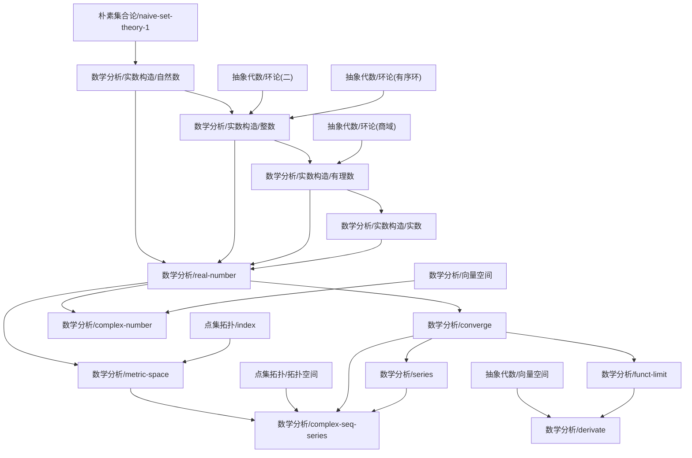

```mermaid
graph TD
1["数学分析/converge"] --> 0["数学分析/funct-limit"]
3["数学分析/real-number"] --> 2["数学分析/complex-number"]
4["数学分析/向量空间"] --> 2["数学分析/complex-number"]
6["抽象代数/向量空间"] --> 5["数学分析/derivate"]
0["数学分析/funct-limit"] --> 5["数学分析/derivate"]
8["数学分析/metric-space"] --> 7["数学分析/complex-seq-series"]
9["点集拓扑/拓扑空间"] --> 7["数学分析/complex-seq-series"]
1["数学分析/converge"] --> 7["数学分析/complex-seq-series"]
10["数学分析/series"] --> 7["数学分析/complex-seq-series"]
3["数学分析/real-number"] --> 8["数学分析/metric-space"]
11["点集拓扑/index"] --> 8["数学分析/metric-space"]
13["数学分析/实数构造/自然数"] --> 12["数学分析/实数构造/整数"]
14["抽象代数/环论(二)"] --> 12["数学分析/实数构造/整数"]
15["抽象代数/环论(有序环)"] --> 12["数学分析/实数构造/整数"]
12["数学分析/实数构造/整数"] --> 16["数学分析/实数构造/有理数"]
17["抽象代数/环论(商域)"] --> 16["数学分析/实数构造/有理数"]
18["朴素集合论/naive-set-theory-1"] --> 13["数学分析/实数构造/自然数"]
16["数学分析/实数构造/有理数"] --> 19["数学分析/实数构造/实数"]
3["数学分析/real-number"] --> 1["数学分析/converge"]
1["数学分析/converge"] --> 10["数学分析/series"]
13["数学分析/实数构造/自然数"] --> 3["数学分析/real-number"]
12["数学分析/实数构造/整数"] --> 3["数学分析/real-number"]
16["数学分析/实数构造/有理数"] --> 3["数学分析/real-number"]
19["数学分析/实数构造/实数"] --> 3["数学分析/real-number"]
```