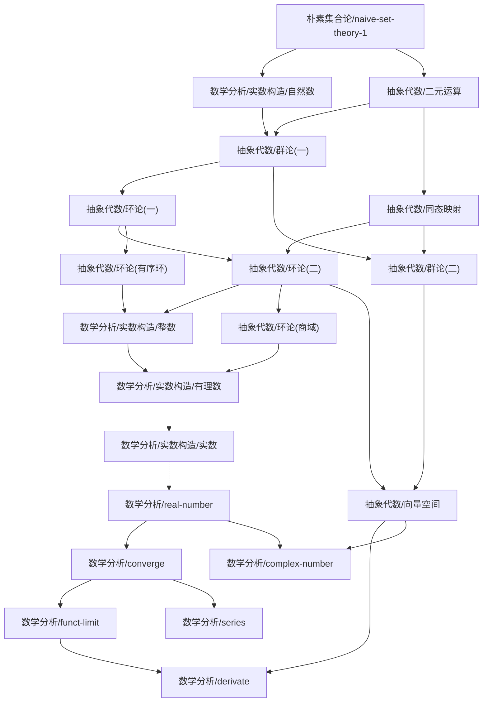

```mermaid
graph TD
1["抽象代数/向量空间"] --> 0["数学分析/derivate"]
2["数学分析/funct-limit"] --> 0["数学分析/derivate"]
4["数学分析/real-number"] --> 3["数学分析/converge"]
3["数学分析/converge"] --> 2["数学分析/funct-limit"]
4["数学分析/real-number"] --> 6["数学分析/complex-number"]
1["抽象代数/向量空间"] --> 6["数学分析/complex-number"]
3["数学分析/converge"] --> 7["数学分析/series"]
8["数学分析/实数构造/实数"] -.-> 4["数学分析/real-number"]
9["数学分析/实数构造/有理数"] --> 8["数学分析/实数构造/实数"]
10["数学分析/实数构造/整数"] --> 9["数学分析/实数构造/有理数"]
11["抽象代数/环论(商域)"] --> 9["数学分析/实数构造/有理数"]
13["朴素集合论/naive-set-theory-1"] --> 12["数学分析/实数构造/自然数"]
14["抽象代数/环论(二)"] --> 10["数学分析/实数构造/整数"]
15["抽象代数/环论(有序环)"] --> 10["数学分析/实数构造/整数"]
16["抽象代数/环论(一)"] --> 14["抽象代数/环论(二)"]
17["抽象代数/同态映射"] --> 14["抽象代数/环论(二)"]
16["抽象代数/环论(一)"] --> 15["抽象代数/环论(有序环)"]
18["抽象代数/群论(一)"] --> 16["抽象代数/环论(一)"]
12["数学分析/实数构造/自然数"] --> 18["抽象代数/群论(一)"]
19["抽象代数/二元运算"] --> 18["抽象代数/群论(一)"]
13["朴素集合论/naive-set-theory-1"] --> 19["抽象代数/二元运算"]
19["抽象代数/二元运算"] --> 17["抽象代数/同态映射"]
14["抽象代数/环论(二)"] --> 11["抽象代数/环论(商域)"]
20["抽象代数/群论(二)"] --> 1["抽象代数/向量空间"]
14["抽象代数/环论(二)"] --> 1["抽象代数/向量空间"]
18["抽象代数/群论(一)"] --> 20["抽象代数/群论(二)"]
17["抽象代数/同态映射"] --> 20["抽象代数/群论(二)"]
```
