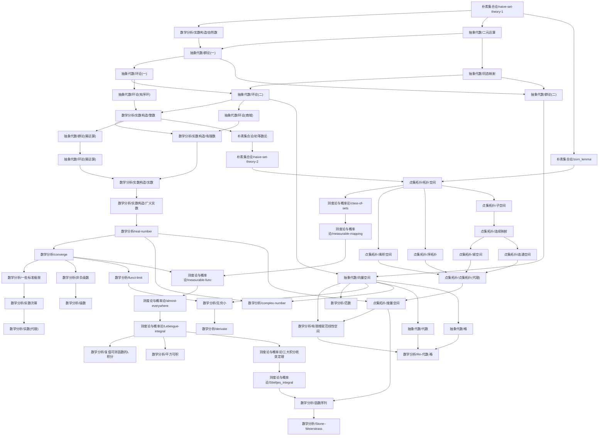

```mermaid
graph TD
1["抽象代数/向量空间"] --> 0["数学分析/有限维赋范线性空间"]
2["点集拓扑/度量空间"] --> 0["数学分析/有限维赋范线性空间"]
4["抽象代数/代数"] --> 3["数学分析/Rn-代数-格"]
5["抽象代数/格"] --> 3["数学分析/Rn-代数-格"]
0["数学分析/有限维赋范线性空间"] --> 3["数学分析/Rn-代数-格"]
7["数学分析/非负级数"] --> 6["数学分析/级数"]
9["数学分析/实数次幂"] --> 8["数学分析/实数(代理)"]
11["数学分析/converge"] --> 10["数学分析/一些标准极限"]
13["数学分析/无穷小"] --> 12["数学分析/derivate"]
14["数学分析/real-number"] --> 11["数学分析/converge"]
10["数学分析/一些标准极限"] --> 9["数学分析/实数次幂"]
11["数学分析/converge"] --> 7["数学分析/非负级数"]
1["抽象代数/向量空间"] --> 15["数学分析/范数"]
17["测度论与概率论/Lebesgue-integral"] --> 16["数学分析/复值可测函数的L积分"]
1["抽象代数/向量空间"] --> 13["数学分析/无穷小"]
18["数学分析/funct-limit"] --> 13["数学分析/无穷小"]
11["数学分析/converge"] --> 18["数学分析/funct-limit"]
14["数学分析/real-number"] --> 20["数学分析/complex-number"]
1["抽象代数/向量空间"] --> 20["数学分析/complex-number"]
21["数学分析/实数构造/广义实数"] --> 14["数学分析/real-number"]
2["点集拓扑/度量空间"] --> 22["数学分析/函数序列"]
23["测度论与概率论/Stieltjes_integral"] --> 22["数学分析/函数序列"]
17["测度论与概率论/Lebesgue-integral"] --> 24["数学分析/平方可积"]
22["数学分析/函数序列"] --> 25["数学分析/Stone–Weierstrass"]
27["数学分析/实数构造/有理数"] --> 26["数学分析/实数构造/实数"]
28["抽象代数/环论(幂运算)"] --> 26["数学分析/实数构造/实数"]
29["数学分析/实数构造/整数"] --> 27["数学分析/实数构造/有理数"]
30["抽象代数/环论(商域)"] --> 27["数学分析/实数构造/有理数"]
26["数学分析/实数构造/实数"] --> 21["数学分析/实数构造/广义实数"]
32["朴素集合论/naive-set-theory-1"] --> 31["数学分析/实数构造/自然数"]
33["抽象代数/环论(二)"] --> 29["数学分析/实数构造/整数"]
34["抽象代数/环论(有序环)"] --> 29["数学分析/实数构造/整数"]
35["抽象代数/环论(一)"] --> 33["抽象代数/环论(二)"]
36["抽象代数/同态映射"] --> 33["抽象代数/环论(二)"]
35["抽象代数/环论(一)"] --> 34["抽象代数/环论(有序环)"]
37["抽象代数/群论(一)"] --> 35["抽象代数/环论(一)"]
31["数学分析/实数构造/自然数"] --> 37["抽象代数/群论(一)"]
38["抽象代数/二元运算"] --> 37["抽象代数/群论(一)"]
32["朴素集合论/naive-set-theory-1"] --> 38["抽象代数/二元运算"]
38["抽象代数/二元运算"] --> 36["抽象代数/同态映射"]
33["抽象代数/环论(二)"] --> 30["抽象代数/环论(商域)"]
39["抽象代数/群论(幂运算)"] --> 28["抽象代数/环论(幂运算)"]
29["数学分析/实数构造/整数"] --> 39["抽象代数/群论(幂运算)"]
40["测度论与概率论/almost-everywhere"] --> 17["测度论与概率论/Lebesgue-integral"]
41["测度论与概率论/measurable-func"] --> 40["测度论与概率论/almost-everywhere"]
42["测度论与概率论/measurable-mapping"] --> 41["测度论与概率论/measurable-func"]
11["数学分析/converge"] --> 41["测度论与概率论/measurable-func"]
43["测度论与概率论/class-of-sets"] --> 42["测度论与概率论/measurable-mapping"]
44["点集拓扑/拓扑空间"] --> 43["测度论与概率论/class-of-sets"]
45["朴素集合论/naive-set-theory-2"] --> 44["点集拓扑/拓扑空间"]
46["朴素集合论/zorn_lemma"] --> 44["点集拓扑/拓扑空间"]
47["朴素集合论/初等数论"] --> 45["朴素集合论/naive-set-theory-2"]
32["朴素集合论/naive-set-theory-1"] --> 46["朴素集合论/zorn_lemma"]
29["数学分析/实数构造/整数"] --> 47["朴素集合论/初等数论"]
14["数学分析/real-number"] --> 2["点集拓扑/度量空间"]
48["点集拓扑/点集拓扑(代理)"] --> 2["点集拓扑/度量空间"]
49["测度论与概率论/三大积分收敛定理"] --> 23["测度论与概率论/Stieltjes_integral"]
17["测度论与概率论/Lebesgue-integral"] --> 49["测度论与概率论/三大积分收敛定理"]
50["点集拓扑/紧空间"] --> 48["点集拓扑/点集拓扑(代理)"]
51["点集拓扑/连通空间"] --> 48["点集拓扑/点集拓扑(代理)"]
52["点集拓扑/乘积空间"] --> 48["点集拓扑/点集拓扑(代理)"]
53["点集拓扑/序拓扑"] --> 48["点集拓扑/点集拓扑(代理)"]
54["点集拓扑/连续映射"] --> 50["点集拓扑/紧空间"]
54["点集拓扑/连续映射"] --> 51["点集拓扑/连通空间"]
44["点集拓扑/拓扑空间"] --> 52["点集拓扑/乘积空间"]
44["点集拓扑/拓扑空间"] --> 53["点集拓扑/序拓扑"]
55["点集拓扑/子空间"] --> 54["点集拓扑/连续映射"]
44["点集拓扑/拓扑空间"] --> 55["点集拓扑/子空间"]
56["抽象代数/群论(二)"] --> 1["抽象代数/向量空间"]
33["抽象代数/环论(二)"] --> 1["抽象代数/向量空间"]
37["抽象代数/群论(一)"] --> 56["抽象代数/群论(二)"]
36["抽象代数/同态映射"] --> 56["抽象代数/群论(二)"]
1["抽象代数/向量空间"] --> 4["抽象代数/代数"]
1["抽象代数/向量空间"] --> 5["抽象代数/格"]
```
