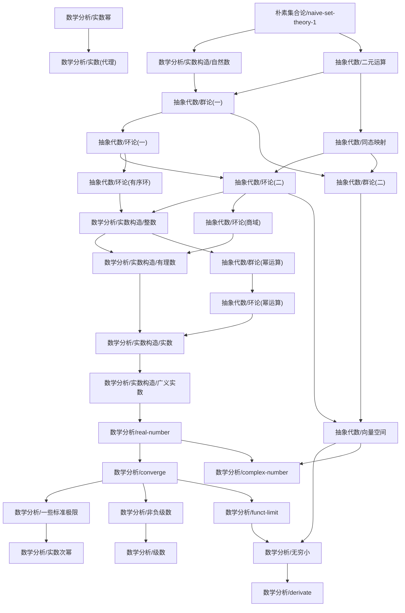

```mermaid
graph TD
1["数学分析/非负级数"] --> 0["数学分析/级数"]
3["数学分析/实数幂"] --> 2["数学分析/实数(代理)"]
5["数学分析/converge"] --> 4["数学分析/一些标准极限"]
7["数学分析/无穷小"] --> 6["数学分析/derivate"]
8["数学分析/real-number"] --> 5["数学分析/converge"]
4["数学分析/一些标准极限"] --> 9["数学分析/实数次幂"]
5["数学分析/converge"] --> 1["数学分析/非负级数"]
10["抽象代数/向量空间"] --> 7["数学分析/无穷小"]
11["数学分析/funct-limit"] --> 7["数学分析/无穷小"]
5["数学分析/converge"] --> 11["数学分析/funct-limit"]
8["数学分析/real-number"] --> 13["数学分析/complex-number"]
10["抽象代数/向量空间"] --> 13["数学分析/complex-number"]
14["数学分析/实数构造/广义实数"] --> 8["数学分析/real-number"]
16["数学分析/实数构造/有理数"] --> 15["数学分析/实数构造/实数"]
17["抽象代数/环论(幂运算)"] --> 15["数学分析/实数构造/实数"]
18["数学分析/实数构造/整数"] --> 16["数学分析/实数构造/有理数"]
19["抽象代数/环论(商域)"] --> 16["数学分析/实数构造/有理数"]
15["数学分析/实数构造/实数"] --> 14["数学分析/实数构造/广义实数"]
21["朴素集合论/naive-set-theory-1"] --> 20["数学分析/实数构造/自然数"]
22["抽象代数/环论(二)"] --> 18["数学分析/实数构造/整数"]
23["抽象代数/环论(有序环)"] --> 18["数学分析/实数构造/整数"]
24["抽象代数/环论(一)"] --> 22["抽象代数/环论(二)"]
25["抽象代数/同态映射"] --> 22["抽象代数/环论(二)"]
24["抽象代数/环论(一)"] --> 23["抽象代数/环论(有序环)"]
26["抽象代数/群论(一)"] --> 24["抽象代数/环论(一)"]
20["数学分析/实数构造/自然数"] --> 26["抽象代数/群论(一)"]
27["抽象代数/二元运算"] --> 26["抽象代数/群论(一)"]
21["朴素集合论/naive-set-theory-1"] --> 27["抽象代数/二元运算"]
27["抽象代数/二元运算"] --> 25["抽象代数/同态映射"]
22["抽象代数/环论(二)"] --> 19["抽象代数/环论(商域)"]
28["抽象代数/群论(幂运算)"] --> 17["抽象代数/环论(幂运算)"]
18["数学分析/实数构造/整数"] --> 28["抽象代数/群论(幂运算)"]
29["抽象代数/群论(二)"] --> 10["抽象代数/向量空间"]
22["抽象代数/环论(二)"] --> 10["抽象代数/向量空间"]
26["抽象代数/群论(一)"] --> 29["抽象代数/群论(二)"]
25["抽象代数/同态映射"] --> 29["抽象代数/群论(二)"]
```
