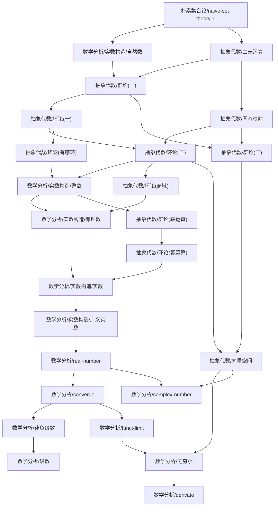

```mermaid
graph TD
1["数学分析/非负级数"] --> 0["数学分析/级数"]
3["数学分析/无穷小"] --> 2["数学分析/derivate"]
5["数学分析/real-number"] --> 4["数学分析/converge"]
4["数学分析/converge"] --> 1["数学分析/非负级数"]
6["抽象代数/向量空间"] --> 3["数学分析/无穷小"]
7["数学分析/funct-limit"] --> 3["数学分析/无穷小"]
4["数学分析/converge"] --> 7["数学分析/funct-limit"]
5["数学分析/real-number"] --> 9["数学分析/complex-number"]
6["抽象代数/向量空间"] --> 9["数学分析/complex-number"]
10["数学分析/实数构造/广义实数"] --> 5["数学分析/real-number"]
12["数学分析/实数构造/有理数"] --> 11["数学分析/实数构造/实数"]
13["抽象代数/环论(幂运算)"] --> 11["数学分析/实数构造/实数"]
14["数学分析/实数构造/整数"] --> 12["数学分析/实数构造/有理数"]
15["抽象代数/环论(商域)"] --> 12["数学分析/实数构造/有理数"]
11["数学分析/实数构造/实数"] --> 10["数学分析/实数构造/广义实数"]
17["朴素集合论/naive-set-theory-1"] --> 16["数学分析/实数构造/自然数"]
18["抽象代数/环论(二)"] --> 14["数学分析/实数构造/整数"]
19["抽象代数/环论(有序环)"] --> 14["数学分析/实数构造/整数"]
20["抽象代数/环论(一)"] --> 18["抽象代数/环论(二)"]
21["抽象代数/同态映射"] --> 18["抽象代数/环论(二)"]
20["抽象代数/环论(一)"] --> 19["抽象代数/环论(有序环)"]
22["抽象代数/群论(一)"] --> 20["抽象代数/环论(一)"]
16["数学分析/实数构造/自然数"] --> 22["抽象代数/群论(一)"]
23["抽象代数/二元运算"] --> 22["抽象代数/群论(一)"]
17["朴素集合论/naive-set-theory-1"] --> 23["抽象代数/二元运算"]
23["抽象代数/二元运算"] --> 21["抽象代数/同态映射"]
18["抽象代数/环论(二)"] --> 15["抽象代数/环论(商域)"]
24["抽象代数/群论(幂运算)"] --> 13["抽象代数/环论(幂运算)"]
14["数学分析/实数构造/整数"] --> 24["抽象代数/群论(幂运算)"]
25["抽象代数/群论(二)"] --> 6["抽象代数/向量空间"]
18["抽象代数/环论(二)"] --> 6["抽象代数/向量空间"]
22["抽象代数/群论(一)"] --> 25["抽象代数/群论(二)"]
21["抽象代数/同态映射"] --> 25["抽象代数/群论(二)"]
```
