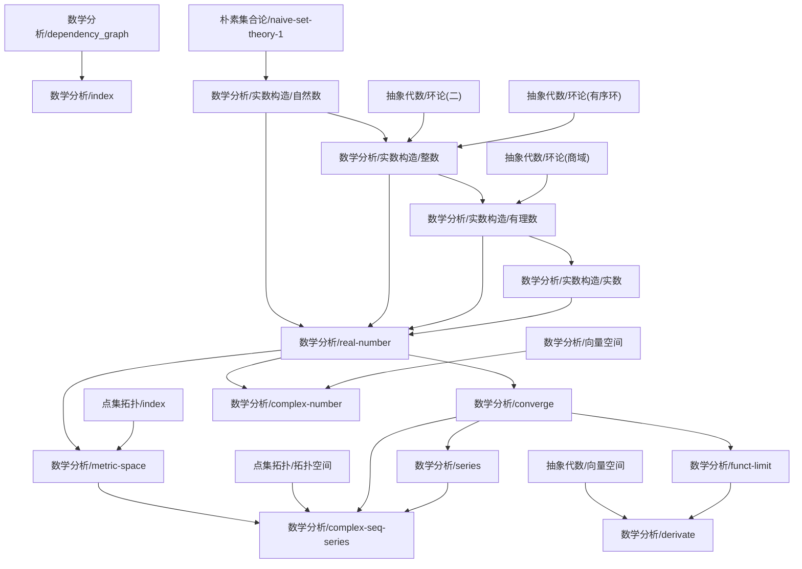

```mermaid
graph TD
1["数学分析/real-number"] --> 0["数学分析/metric-space"]
2["点集拓扑/index"] --> 0["数学分析/metric-space"]
0["数学分析/metric-space"] --> 3["数学分析/complex-seq-series"]
4["点集拓扑/拓扑空间"] --> 3["数学分析/complex-seq-series"]
5["数学分析/converge"] --> 3["数学分析/complex-seq-series"]
6["数学分析/series"] --> 3["数学分析/complex-seq-series"]
8["抽象代数/向量空间"] --> 7["数学分析/derivate"]
9["数学分析/funct-limit"] --> 7["数学分析/derivate"]
1["数学分析/real-number"] --> 5["数学分析/converge"]
11["数学分析/dependency_graph"] --> 10["数学分析/index"]
5["数学分析/converge"] --> 9["数学分析/funct-limit"]
1["数学分析/real-number"] --> 12["数学分析/complex-number"]
13["数学分析/向量空间"] --> 12["数学分析/complex-number"]
5["数学分析/converge"] --> 6["数学分析/series"]
14["数学分析/实数构造/自然数"] --> 1["数学分析/real-number"]
15["数学分析/实数构造/整数"] --> 1["数学分析/real-number"]
16["数学分析/实数构造/有理数"] --> 1["数学分析/real-number"]
17["数学分析/实数构造/实数"] --> 1["数学分析/real-number"]
16["数学分析/实数构造/有理数"] --> 17["数学分析/实数构造/实数"]
15["数学分析/实数构造/整数"] --> 16["数学分析/实数构造/有理数"]
18["抽象代数/环论(商域)"] --> 16["数学分析/实数构造/有理数"]
19["朴素集合论/naive-set-theory-1"] --> 14["数学分析/实数构造/自然数"]
14["数学分析/实数构造/自然数"] --> 15["数学分析/实数构造/整数"]
20["抽象代数/环论(二)"] --> 15["数学分析/实数构造/整数"]
21["抽象代数/环论(有序环)"] --> 15["数学分析/实数构造/整数"]
```