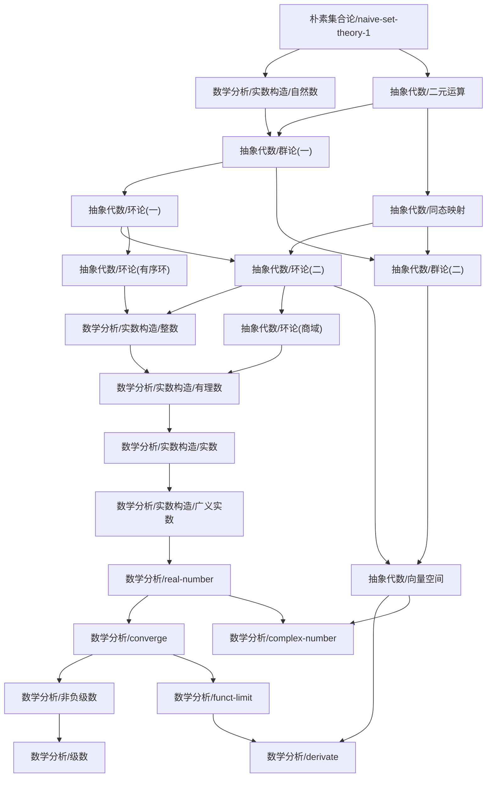

```mermaid
graph TD
1["数学分析/非负级数"] --> 0["数学分析/级数"]
3["抽象代数/向量空间"] --> 2["数学分析/derivate"]
4["数学分析/funct-limit"] --> 2["数学分析/derivate"]
6["数学分析/real-number"] --> 5["数学分析/converge"]
5["数学分析/converge"] --> 1["数学分析/非负级数"]
5["数学分析/converge"] --> 4["数学分析/funct-limit"]
6["数学分析/real-number"] --> 8["数学分析/complex-number"]
3["抽象代数/向量空间"] --> 8["数学分析/complex-number"]
9["数学分析/实数构造/广义实数"] --> 6["数学分析/real-number"]
11["数学分析/实数构造/有理数"] --> 10["数学分析/实数构造/实数"]
12["数学分析/实数构造/整数"] --> 11["数学分析/实数构造/有理数"]
13["抽象代数/环论(商域)"] --> 11["数学分析/实数构造/有理数"]
10["数学分析/实数构造/实数"] --> 9["数学分析/实数构造/广义实数"]
15["朴素集合论/naive-set-theory-1"] --> 14["数学分析/实数构造/自然数"]
16["抽象代数/环论(二)"] --> 12["数学分析/实数构造/整数"]
17["抽象代数/环论(有序环)"] --> 12["数学分析/实数构造/整数"]
18["抽象代数/环论(一)"] --> 16["抽象代数/环论(二)"]
19["抽象代数/同态映射"] --> 16["抽象代数/环论(二)"]
18["抽象代数/环论(一)"] --> 17["抽象代数/环论(有序环)"]
20["抽象代数/群论(一)"] --> 18["抽象代数/环论(一)"]
14["数学分析/实数构造/自然数"] --> 20["抽象代数/群论(一)"]
21["抽象代数/二元运算"] --> 20["抽象代数/群论(一)"]
15["朴素集合论/naive-set-theory-1"] --> 21["抽象代数/二元运算"]
21["抽象代数/二元运算"] --> 19["抽象代数/同态映射"]
16["抽象代数/环论(二)"] --> 13["抽象代数/环论(商域)"]
22["抽象代数/群论(二)"] --> 3["抽象代数/向量空间"]
16["抽象代数/环论(二)"] --> 3["抽象代数/向量空间"]
20["抽象代数/群论(一)"] --> 22["抽象代数/群论(二)"]
19["抽象代数/同态映射"] --> 22["抽象代数/群论(二)"]
```
