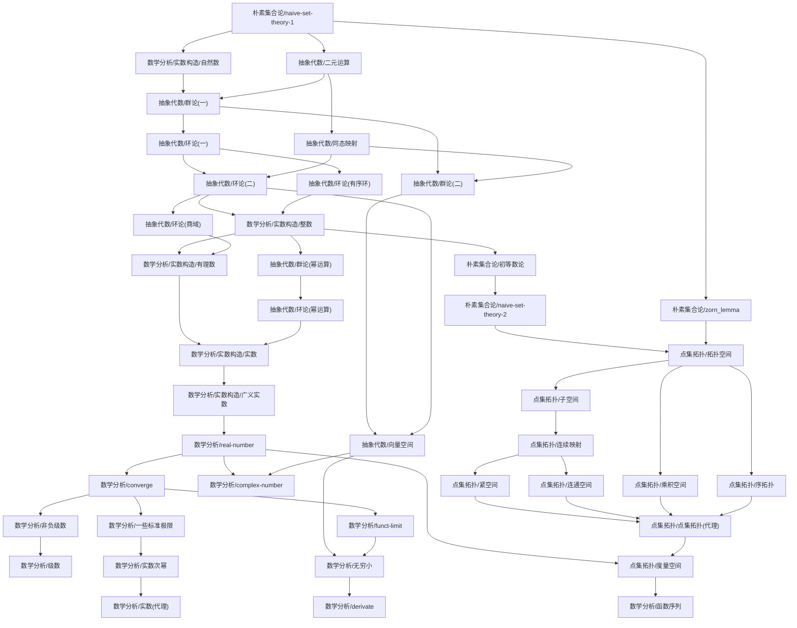

```mermaid
graph TD
1["数学分析/非负级数"] --> 0["数学分析/级数"]
3["数学分析/实数次幂"] --> 2["数学分析/实数(代理)"]
5["数学分析/converge"] --> 4["数学分析/一些标准极限"]
7["数学分析/无穷小"] --> 6["数学分析/derivate"]
8["数学分析/real-number"] --> 5["数学分析/converge"]
4["数学分析/一些标准极限"] --> 3["数学分析/实数次幂"]
5["数学分析/converge"] --> 1["数学分析/非负级数"]
9["抽象代数/向量空间"] --> 7["数学分析/无穷小"]
10["数学分析/funct-limit"] --> 7["数学分析/无穷小"]
5["数学分析/converge"] --> 10["数学分析/funct-limit"]
8["数学分析/real-number"] --> 12["数学分析/complex-number"]
9["抽象代数/向量空间"] --> 12["数学分析/complex-number"]
13["数学分析/实数构造/广义实数"] --> 8["数学分析/real-number"]
15["点集拓扑/度量空间"] --> 14["数学分析/函数序列"]
17["数学分析/实数构造/有理数"] --> 16["数学分析/实数构造/实数"]
18["抽象代数/环论(幂运算)"] --> 16["数学分析/实数构造/实数"]
19["数学分析/实数构造/整数"] --> 17["数学分析/实数构造/有理数"]
20["抽象代数/环论(商域)"] --> 17["数学分析/实数构造/有理数"]
16["数学分析/实数构造/实数"] --> 13["数学分析/实数构造/广义实数"]
22["朴素集合论/naive-set-theory-1"] --> 21["数学分析/实数构造/自然数"]
23["抽象代数/环论(二)"] --> 19["数学分析/实数构造/整数"]
24["抽象代数/环论(有序环)"] --> 19["数学分析/实数构造/整数"]
25["抽象代数/环论(一)"] --> 23["抽象代数/环论(二)"]
26["抽象代数/同态映射"] --> 23["抽象代数/环论(二)"]
25["抽象代数/环论(一)"] --> 24["抽象代数/环论(有序环)"]
27["抽象代数/群论(一)"] --> 25["抽象代数/环论(一)"]
21["数学分析/实数构造/自然数"] --> 27["抽象代数/群论(一)"]
28["抽象代数/二元运算"] --> 27["抽象代数/群论(一)"]
22["朴素集合论/naive-set-theory-1"] --> 28["抽象代数/二元运算"]
28["抽象代数/二元运算"] --> 26["抽象代数/同态映射"]
23["抽象代数/环论(二)"] --> 20["抽象代数/环论(商域)"]
29["抽象代数/群论(幂运算)"] --> 18["抽象代数/环论(幂运算)"]
19["数学分析/实数构造/整数"] --> 29["抽象代数/群论(幂运算)"]
8["数学分析/real-number"] --> 15["点集拓扑/度量空间"]
30["点集拓扑/点集拓扑(代理)"] --> 15["点集拓扑/度量空间"]
31["点集拓扑/紧空间"] --> 30["点集拓扑/点集拓扑(代理)"]
32["点集拓扑/连通空间"] --> 30["点集拓扑/点集拓扑(代理)"]
33["点集拓扑/乘积空间"] --> 30["点集拓扑/点集拓扑(代理)"]
34["点集拓扑/序拓扑"] --> 30["点集拓扑/点集拓扑(代理)"]
35["点集拓扑/连续映射"] --> 31["点集拓扑/紧空间"]
35["点集拓扑/连续映射"] --> 32["点集拓扑/连通空间"]
36["点集拓扑/拓扑空间"] --> 33["点集拓扑/乘积空间"]
36["点集拓扑/拓扑空间"] --> 34["点集拓扑/序拓扑"]
37["朴素集合论/naive-set-theory-2"] --> 36["点集拓扑/拓扑空间"]
38["朴素集合论/zorn_lemma"] --> 36["点集拓扑/拓扑空间"]
39["朴素集合论/初等数论"] --> 37["朴素集合论/naive-set-theory-2"]
22["朴素集合论/naive-set-theory-1"] --> 38["朴素集合论/zorn_lemma"]
19["数学分析/实数构造/整数"] --> 39["朴素集合论/初等数论"]
40["点集拓扑/子空间"] --> 35["点集拓扑/连续映射"]
36["点集拓扑/拓扑空间"] --> 40["点集拓扑/子空间"]
41["抽象代数/群论(二)"] --> 9["抽象代数/向量空间"]
23["抽象代数/环论(二)"] --> 9["抽象代数/向量空间"]
27["抽象代数/群论(一)"] --> 41["抽象代数/群论(二)"]
26["抽象代数/同态映射"] --> 41["抽象代数/群论(二)"]
```
