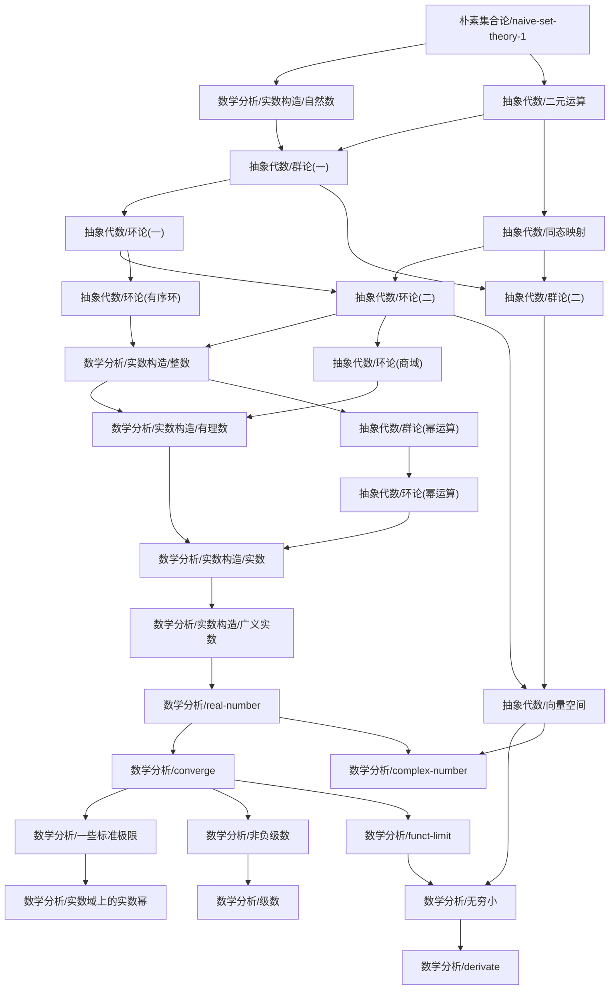

```mermaid
graph TD
1["数学分析/非负级数"] --> 0["数学分析/级数"]
3["数学分析/converge"] --> 2["数学分析/一些标准极限"]
2["数学分析/一些标准极限"] --> 4["数学分析/实数域上的实数幂"]
6["数学分析/无穷小"] --> 5["数学分析/derivate"]
7["数学分析/real-number"] --> 3["数学分析/converge"]
3["数学分析/converge"] --> 1["数学分析/非负级数"]
8["抽象代数/向量空间"] --> 6["数学分析/无穷小"]
9["数学分析/funct-limit"] --> 6["数学分析/无穷小"]
3["数学分析/converge"] --> 9["数学分析/funct-limit"]
7["数学分析/real-number"] --> 11["数学分析/complex-number"]
8["抽象代数/向量空间"] --> 11["数学分析/complex-number"]
12["数学分析/实数构造/广义实数"] --> 7["数学分析/real-number"]
14["数学分析/实数构造/有理数"] --> 13["数学分析/实数构造/实数"]
15["抽象代数/环论(幂运算)"] --> 13["数学分析/实数构造/实数"]
16["数学分析/实数构造/整数"] --> 14["数学分析/实数构造/有理数"]
17["抽象代数/环论(商域)"] --> 14["数学分析/实数构造/有理数"]
13["数学分析/实数构造/实数"] --> 12["数学分析/实数构造/广义实数"]
19["朴素集合论/naive-set-theory-1"] --> 18["数学分析/实数构造/自然数"]
20["抽象代数/环论(二)"] --> 16["数学分析/实数构造/整数"]
21["抽象代数/环论(有序环)"] --> 16["数学分析/实数构造/整数"]
22["抽象代数/环论(一)"] --> 20["抽象代数/环论(二)"]
23["抽象代数/同态映射"] --> 20["抽象代数/环论(二)"]
22["抽象代数/环论(一)"] --> 21["抽象代数/环论(有序环)"]
24["抽象代数/群论(一)"] --> 22["抽象代数/环论(一)"]
18["数学分析/实数构造/自然数"] --> 24["抽象代数/群论(一)"]
25["抽象代数/二元运算"] --> 24["抽象代数/群论(一)"]
19["朴素集合论/naive-set-theory-1"] --> 25["抽象代数/二元运算"]
25["抽象代数/二元运算"] --> 23["抽象代数/同态映射"]
20["抽象代数/环论(二)"] --> 17["抽象代数/环论(商域)"]
26["抽象代数/群论(幂运算)"] --> 15["抽象代数/环论(幂运算)"]
16["数学分析/实数构造/整数"] --> 26["抽象代数/群论(幂运算)"]
27["抽象代数/群论(二)"] --> 8["抽象代数/向量空间"]
20["抽象代数/环论(二)"] --> 8["抽象代数/向量空间"]
24["抽象代数/群论(一)"] --> 27["抽象代数/群论(二)"]
23["抽象代数/同态映射"] --> 27["抽象代数/群论(二)"]
```
