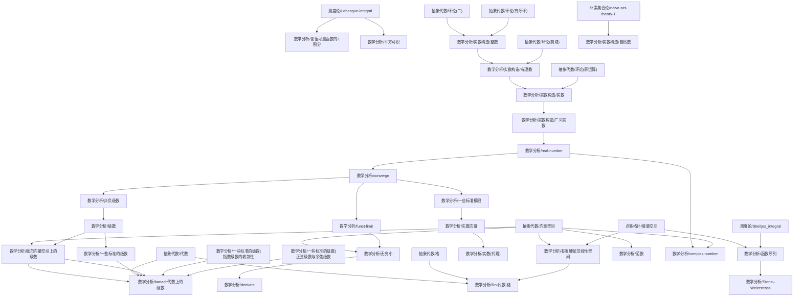

```mermaid
graph TD
1["抽象代数/向量空间"] --> 0["数学分析/有限维赋范线性空间"]
2["点集拓扑/度量空间"] --> 0["数学分析/有限维赋范线性空间"]
4["抽象代数/代数"] --> 3["数学分析/Rn-代数-格"]
5["抽象代数/格"] --> 3["数学分析/Rn-代数-格"]
0["数学分析/有限维赋范线性空间"] --> 3["数学分析/Rn-代数-格"]
7["数学分析/非负级数"] --> 6["数学分析/级数"]
9["数学分析/赋范向量空间上的级数"] --> 8["数学分析/banach代数上的级数"]
4["抽象代数/代数"] --> 8["数学分析/banach代数上的级数"]
10["数学分析/一些标准的级数"] --> 8["数学分析/banach代数上的级数"]
9["数学分析/赋范向量空间上的级数"] --> 8["数学分析/banach代数上的级数"]
11["数学分析/一些标准的级数|指数级数的收敛性"] --> 8["数学分析/banach代数上的级数"]
12["数学分析/一些标准的级数|正弦级数与余弦级数"] --> 8["数学分析/banach代数上的级数"]
14["数学分析/实数次幂"] --> 13["数学分析/实数(代理)"]
6["数学分析/级数"] --> 10["数学分析/一些标准的级数"]
16["数学分析/converge"] --> 15["数学分析/一些标准极限"]
18["数学分析/无穷小"] --> 17["数学分析/derivate"]
19["数学分析/real-number"] --> 16["数学分析/converge"]
15["数学分析/一些标准极限"] --> 14["数学分析/实数次幂"]
16["数学分析/converge"] --> 7["数学分析/非负级数"]
1["抽象代数/向量空间"] --> 20["数学分析/范数"]
22["测度论/Lebesgue-integral"] --> 21["数学分析/复值可测函数的L积分"]
1["抽象代数/向量空间"] --> 18["数学分析/无穷小"]
23["数学分析/funct-limit"] --> 18["数学分析/无穷小"]
1["抽象代数/向量空间"] --> 9["数学分析/赋范向量空间上的级数"]
6["数学分析/级数"] --> 9["数学分析/赋范向量空间上的级数"]
16["数学分析/converge"] --> 23["数学分析/funct-limit"]
19["数学分析/real-number"] --> 25["数学分析/complex-number"]
1["抽象代数/向量空间"] --> 25["数学分析/complex-number"]
26["数学分析/实数构造/广义实数"] --> 19["数学分析/real-number"]
2["点集拓扑/度量空间"] --> 27["数学分析/函数序列"]
28["测度论/Stieltjes_integral"] --> 27["数学分析/函数序列"]
22["测度论/Lebesgue-integral"] --> 29["数学分析/平方可积"]
27["数学分析/函数序列"] --> 30["数学分析/Stone–Weierstrass"]
32["数学分析/实数构造/有理数"] --> 31["数学分析/实数构造/实数"]
33["抽象代数/环论(幂运算)"] --> 31["数学分析/实数构造/实数"]
34["数学分析/实数构造/整数"] --> 32["数学分析/实数构造/有理数"]
35["抽象代数/环论(商域)"] --> 32["数学分析/实数构造/有理数"]
31["数学分析/实数构造/实数"] --> 26["数学分析/实数构造/广义实数"]
37["朴素集合论/naive-set-theory-1"] --> 36["数学分析/实数构造/自然数"]
38["抽象代数/环论(二)"] --> 34["数学分析/实数构造/整数"]
39["抽象代数/环论(有序环)"] --> 34["数学分析/实数构造/整数"]
```