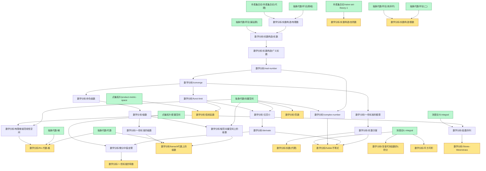

```mermaid
graph TD
1["抽象代数/向量空间"] --> 0["数学分析/有限维赋范线性空间"]
2["点集拓扑/度量空间"] --> 0["数学分析/有限维赋范线性空间"]
4["抽象代数/代数"] --> 3["数学分析/Rn-代数-格"]
5["抽象代数/格"] --> 3["数学分析/Rn-代数-格"]
0["数学分析/有限维赋范线性空间"] --> 3["数学分析/Rn-代数-格"]
7["数学分析/非负级数"] --> 6["数学分析/级数"]
9["数学分析/derivate"] --> 8["数学分析/微分中值定理"]
2["点集拓扑/度量空间"] --> 8["数学分析/微分中值定理"]
11["数学分析/赋范向量空间上的级数"] --> 10["数学分析/banach代数上的级数"]
4["抽象代数/代数"] --> 10["数学分析/banach代数上的级数"]
12["数学分析/一些标准的级数"] --> 10["数学分析/banach代数上的级数"]
14["数学分析/实数次幂"] --> 13["数学分析/实数(代理)"]
6["数学分析/级数"] --> 12["数学分析/一些标准的级数"]
14["数学分析/实数次幂"] --> 15["数学分析/holder不等式"]
9["数学分析/derivate"] --> 15["数学分析/holder不等式"]
16["数学分析/complex-number"] --> 15["数学分析/holder不等式"]
17["测度论/L-integral"] --> 15["数学分析/holder不等式"]
8["数学分析/微分中值定理"] --> 18["数学分析/一些标准的导数"]
20["数学分析/funct-limit"] --> 19["数学分析/连续函数"]
21["点集拓扑/product-metric-space"] --> 19["数学分析/连续函数"]
22["数学分析/无穷小"] --> 9["数学分析/derivate"]
24["数学分析/real-number"] --> 23["数学分析/converge"]
25["数学分析/一些标准的极限"] --> 14["数学分析/实数次幂"]
23["数学分析/converge"] --> 7["数学分析/非负级数"]
1["抽象代数/向量空间"] --> 26["数学分析/范数"]
17["测度论/L-integral"] --> 27["数学分析/复值可测函数的L积分"]
1["抽象代数/向量空间"] --> 22["数学分析/无穷小"]
20["数学分析/funct-limit"] --> 22["数学分析/无穷小"]
1["抽象代数/向量空间"] --> 11["数学分析/赋范向量空间上的级数"]
6["数学分析/级数"] --> 11["数学分析/赋范向量空间上的级数"]
23["数学分析/converge"] --> 20["数学分析/funct-limit"]
24["数学分析/real-number"] --> 16["数学分析/complex-number"]
1["抽象代数/向量空间"] --> 16["数学分析/complex-number"]
23["数学分析/converge"] --> 25["数学分析/一些标准的极限"]
28["数学分析/实数构造/广义实数"] --> 24["数学分析/real-number"]
2["点集拓扑/度量空间"] --> 29["数学分析/函数序列"]
30["测度论/S-integral"] --> 29["数学分析/函数序列"]
17["测度论/L-integral"] --> 31["数学分析/平方可积"]
29["数学分析/函数序列"] --> 32["数学分析/Stone–Weierstrass"]
34["数学分析/实数构造/有理数"] --> 33["数学分析/实数构造/实数"]
35["抽象代数/环论(幂运算)"] --> 33["数学分析/实数构造/实数"]
36["抽象代数/环论(商域)"] --> 34["数学分析/实数构造/有理数"]
37["朴素集合论/朴素集合论(代理)"] --> 34["数学分析/实数构造/有理数"]
33["数学分析/实数构造/实数"] --> 28["数学分析/实数构造/广义实数"]
39["朴素集合论/naive-set-theory-1"] --> 38["数学分析/实数构造/自然数"]
41["抽象代数/环论(二)"] --> 40["数学分析/实数构造/整数"]
42["抽象代数/环论(有序环)"] --> 40["数学分析/实数构造/整数"]
classDef leaf fill:#fde68a,stroke:#b45309
class 3,10,13,15,18,19,26,27,31,32,38,40 leaf
classDef foundationRoot fill:#bbf7d0,stroke:#15803d
class 1,2,4,5,17,21,30,35,36,37,39,41,42 foundationRoot
```