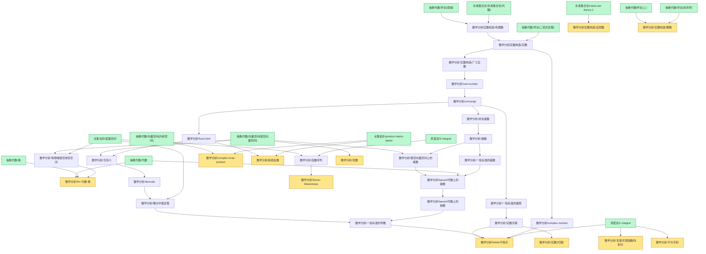

```mermaid
graph TD
1["抽象代数/向量空间(赋范向量空间)"] --> 0["数学分析/有限维赋范线性空间"]
2["点集拓扑/度量空间"] --> 0["数学分析/有限维赋范线性空间"]
4["抽象代数/代数"] --> 3["数学分析/Rn-代数-格"]
5["抽象代数/格"] --> 3["数学分析/Rn-代数-格"]
0["数学分析/有限维赋范线性空间"] --> 3["数学分析/Rn-代数-格"]
7["数学分析/非负级数"] --> 6["数学分析/级数"]
9["数学分析/derivate"] --> 8["数学分析/微分中值定理"]
2["点集拓扑/度量空间"] --> 8["数学分析/微分中值定理"]
11["数学分析/赋范向量空间上的级数"] --> 10["数学分析/banach代数上的级数"]
4["抽象代数/代数"] --> 10["数学分析/banach代数上的级数"]
12["数学分析/一些标准的级数"] --> 10["数学分析/banach代数上的级数"]
14["数学分析/实数次幂"] --> 13["数学分析/实数(代理)"]
6["数学分析/级数"] --> 12["数学分析/一些标准的级数"]
10["数学分析/banach代数上的级数"] --> 15["数学分析/banach代数上的指数"]
17["抽象代数/向量空间(内积空间)"] --> 16["数学分析/complex-inner-product"]
18["点集拓扑/product-metric-space"] --> 16["数学分析/complex-inner-product"]
14["数学分析/实数次幂"] --> 19["数学分析/holder不等式"]
20["数学分析/一些标准的导数"] --> 19["数学分析/holder不等式"]
21["数学分析/complex-number"] --> 19["数学分析/holder不等式"]
22["测度论/L-integral"] --> 19["数学分析/holder不等式"]
8["数学分析/微分中值定理"] --> 20["数学分析/一些标准的导数"]
15["数学分析/banach代数上的指数"] --> 20["数学分析/一些标准的导数"]
24["数学分析/funct-limit"] --> 23["数学分析/连续函数"]
18["点集拓扑/product-metric-space"] --> 23["数学分析/连续函数"]
25["数学分析/无穷小"] --> 9["数学分析/derivate"]
27["数学分析/real-number"] --> 26["数学分析/converge"]
28["数学分析/一些标准的极限"] --> 14["数学分析/实数次幂"]
26["数学分析/converge"] --> 7["数学分析/非负级数"]
1["抽象代数/向量空间(赋范向量空间)"] --> 29["数学分析/范数"]
22["测度论/L-integral"] --> 30["数学分析/复值可测函数的L积分"]
1["抽象代数/向量空间(赋范向量空间)"] --> 25["数学分析/无穷小"]
24["数学分析/funct-limit"] --> 25["数学分析/无穷小"]
1["抽象代数/向量空间(赋范向量空间)"] --> 11["数学分析/赋范向量空间上的级数"]
6["数学分析/级数"] --> 11["数学分析/赋范向量空间上的级数"]
26["数学分析/converge"] --> 24["数学分析/funct-limit"]
31["数学分析/实数构造/实数"] --> 21["数学分析/complex-number"]
26["数学分析/converge"] --> 28["数学分析/一些标准的极限"]
32["数学分析/实数构造/广义实数"] --> 27["数学分析/real-number"]
2["点集拓扑/度量空间"] --> 33["数学分析/函数序列"]
34["测度论/S-integral"] --> 33["数学分析/函数序列"]
22["测度论/L-integral"] --> 35["数学分析/平方可积"]
33["数学分析/函数序列"] --> 36["数学分析/Stone–Weierstrass"]
37["数学分析/实数构造/有理数"] --> 31["数学分析/实数构造/实数"]
38["抽象代数/环论(二项式定理)"] --> 31["数学分析/实数构造/实数"]
39["抽象代数/环论(商域)"] --> 37["数学分析/实数构造/有理数"]
40["朴素集合论/朴素集合论(代理)"] --> 37["数学分析/实数构造/有理数"]
31["数学分析/实数构造/实数"] --> 32["数学分析/实数构造/广义实数"]
42["朴素集合论/naive-set-theory-1"] --> 41["数学分析/实数构造/自然数"]
44["抽象代数/环论(二)"] --> 43["数学分析/实数构造/整数"]
45["抽象代数/环论(有序环)"] --> 43["数学分析/实数构造/整数"]
classDef leaf fill:#fde68a,stroke:#b45309
class 3,13,16,19,23,29,30,35,36,41,43 leaf
classDef foundationRoot fill:#bbf7d0,stroke:#15803d
class 1,2,4,5,17,18,22,34,38,39,40,42,44,45 foundationRoot
```