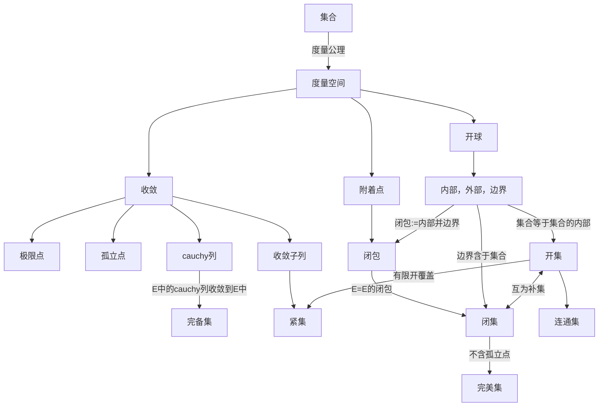
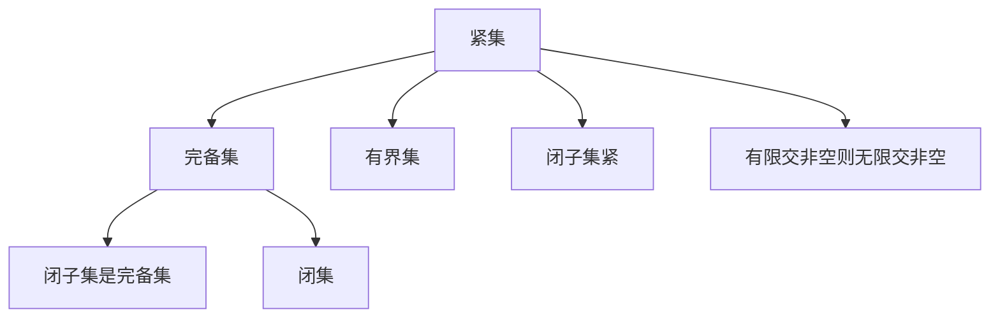

## Prerequisites

- [[数学分析/real-number]]

## 定义

- 在集合$X$上定义一个函数$d:X \times X \rightarrow R^+$,满足以下条件，则称$d$为$X$上的**度量**，$(X,d)$为**度量空间**。
  - 正定性：$d(x,y) \geq 0$, and $d(x,y)=0 \Leftrightarrow x=y$
  - 对称性：$d(x,y)=d(y,x)$
  - 三角不等式：$d(x,y) \leq d(x,z)+d(z,y)$
- $\forall x \in X, \forall r>0$,可定义**开球** $B(x,r)=\{y \in X:d(x,y)<r\}$
- $x\in E \subseteq X$,称$x$是$E$的**内点**，若存在$r>0$,使得$B(x,r) \subseteq E$
- 称$A^{\circ}$为$A$的**内部**，若$A^{\circ}$为$A$的所有内点的构成的集合
- 称$(A^{c})^{\circ}$为$A$的**外部**
- 称$\partial A:=X\setminus (A \cup (A^{c})^{\circ})$ 为$A$的 **边界**
- 称$\overline{A}:=A \cup \partial A$为$A$的**闭包**
- 称$A$为**闭集**，若$\partial A \subseteq A$
- 称$A$为**开集**，若$A=A^{\circ}$
- 称$A$为**连通集**，若$A$不能表示为两个不相交的非空开集的并集
- 称$B$为**紧集**，若$B$的任意开覆盖都有有限子覆盖
- 称$x\in X$为$E$的**附着点**，若$\forall r>0, B(x,r) \cap E \neq \emptyset$
- 称${x_n}$为**cauchy列**，若$\forall \epsilon>0, \exists N \in \mathbb{Z}_{\geq 0}, \forall m,n>N, d(x_m,x_n)<\epsilon$
- 称${x_n}$**收敛**，若$\exists x \in X, \forall \epsilon>0, \exists N \in \mathbb{Z}_{\geq 0}, \forall n>N, d(x_n,x)<\epsilon$
- 称$E$为**完备集**，若$E$中的cauchy列都收敛到$E$中
- 称$x\in X$为$E$的**极限点**，若$\forall r>0, B(x,r) \cap (E\setminus \{x\}) \neq \emptyset$
- 称$x\in E$为$E$的**孤立点**，若$\exists r>0, B(x,r) \cap E = \{x\}$
- 称$E$为**完美集**，若$E$为不含孤立点的闭集
- 连续函数$:=$开集的逆像开集

定义图中，若从"集合"出发的两条有向路径到达同一个结点，则表示两种定义方式等价。

## 性质

1. 附着点=极限点+孤立点
2. $\mathbb{R}^n$ 中非空完美集不可数
3. $\mathbb{R}$ 中的连通集等价于区间
4. 连续函数复合连续函数仍为连续函数
5. 紧集上的连续函数一致连续
6. 连续函数将紧集映射到紧集
7. 连续函数将连通集映射到连通集
