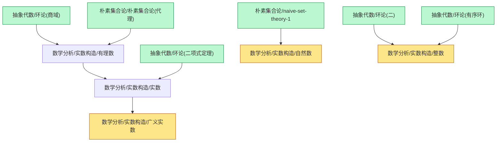

```mermaid
graph TD
1["数学分析/实数构造/有理数"] --> 0["数学分析/实数构造/实数"]
2["抽象代数/环论(二项式定理)"] --> 0["数学分析/实数构造/实数"]
3["抽象代数/环论(商域)"] --> 1["数学分析/实数构造/有理数"]
4["朴素集合论/朴素集合论(代理)"] --> 1["数学分析/实数构造/有理数"]
0["数学分析/实数构造/实数"] --> 5["数学分析/实数构造/广义实数"]
7["朴素集合论/naive-set-theory-1"] --> 6["数学分析/实数构造/自然数"]
9["抽象代数/环论(二)"] --> 8["数学分析/实数构造/整数"]
10["抽象代数/环论(有序环)"] --> 8["数学分析/实数构造/整数"]
classDef leaf fill:#fde68a,stroke:#b45309
class 5,6,8 leaf
classDef foundationRoot fill:#bbf7d0,stroke:#15803d
class 2,3,4,7,9,10 foundationRoot
click 0 "/数学分析/实数构造/实数" "数学分析/实数构造/实数"
click 1 "/数学分析/实数构造/有理数" "数学分析/实数构造/有理数"
click 2 "/抽象代数/环论(二项式定理)" "抽象代数/环论(二项式定理)"
click 3 "/抽象代数/环论(商域)" "抽象代数/环论(商域)"
click 4 "/朴素集合论/朴素集合论(代理)" "朴素集合论/朴素集合论(代理)"
click 5 "/数学分析/实数构造/广义实数" "数学分析/实数构造/广义实数"
click 6 "/数学分析/实数构造/自然数" "数学分析/实数构造/自然数"
click 7 "/朴素集合论/naive-set-theory-1" "朴素集合论/naive-set-theory-1"
click 8 "/数学分析/实数构造/整数" "数学分析/实数构造/整数"
click 9 "/抽象代数/环论(二)" "抽象代数/环论(二)"
click 10 "/抽象代数/环论(有序环)" "抽象代数/环论(有序环)"
```