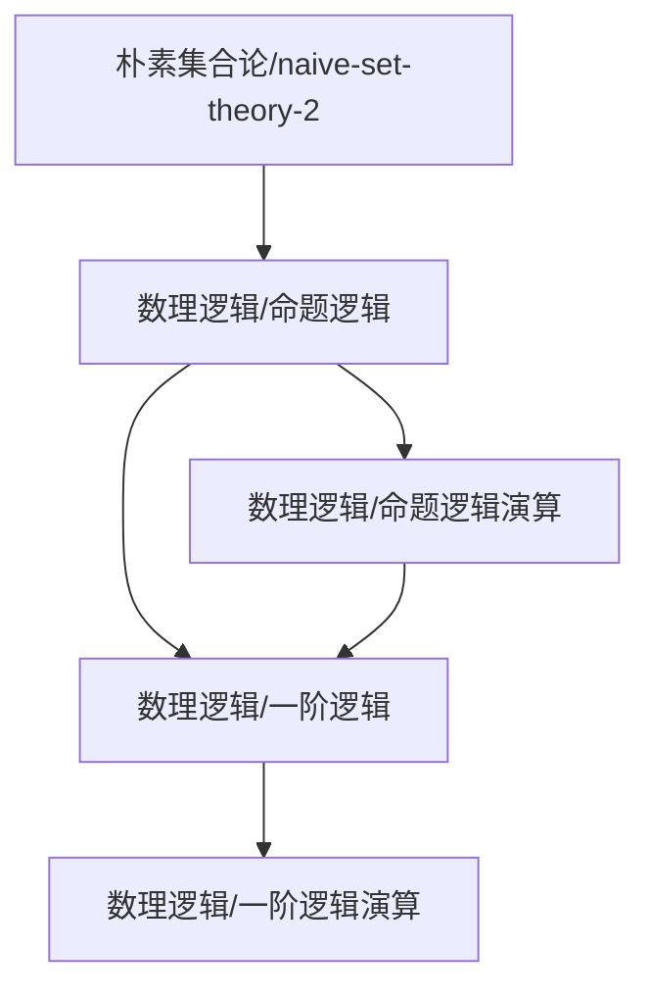

```mermaid
graph TD
1["数理逻辑/一阶逻辑"] --> 0["数理逻辑/一阶逻辑演算"]
2["数理逻辑/命题逻辑"] --> 1["数理逻辑/一阶逻辑"]
3["数理逻辑/命题逻辑演算"] --> 1["数理逻辑/一阶逻辑"]
2["数理逻辑/命题逻辑"] --> 3["数理逻辑/命题逻辑演算"]
5["朴素集合论/naive-set-theory-2"] --> 2["数理逻辑/命题逻辑"]
```