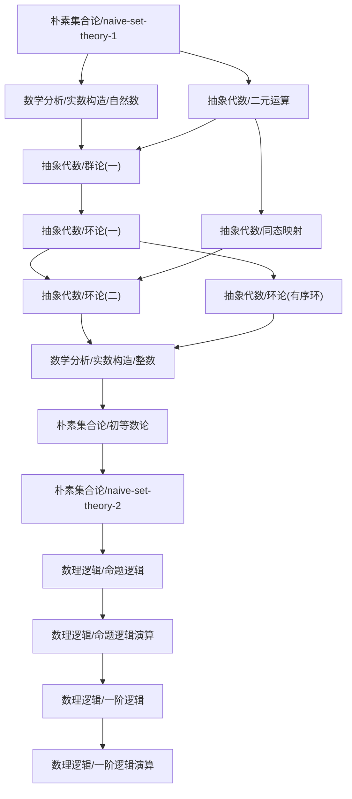

```mermaid
graph TD
1["数理逻辑/一阶逻辑"] --> 0["数理逻辑/一阶逻辑演算"]
2["数理逻辑/命题逻辑演算"] --> 1["数理逻辑/一阶逻辑"]
3["数理逻辑/命题逻辑"] --> 2["数理逻辑/命题逻辑演算"]
5["朴素集合论/naive-set-theory-2"] --> 3["数理逻辑/命题逻辑"]
6["朴素集合论/初等数论"] --> 5["朴素集合论/naive-set-theory-2"]
7["数学分析/实数构造/整数"] --> 6["朴素集合论/初等数论"]
8["抽象代数/环论(二)"] --> 7["数学分析/实数构造/整数"]
9["抽象代数/环论(有序环)"] --> 7["数学分析/实数构造/整数"]
10["抽象代数/环论(一)"] --> 8["抽象代数/环论(二)"]
11["抽象代数/同态映射"] --> 8["抽象代数/环论(二)"]
10["抽象代数/环论(一)"] --> 9["抽象代数/环论(有序环)"]
12["抽象代数/群论(一)"] --> 10["抽象代数/环论(一)"]
13["数学分析/实数构造/自然数"] --> 12["抽象代数/群论(一)"]
14["抽象代数/二元运算"] --> 12["抽象代数/群论(一)"]
15["朴素集合论/naive-set-theory-1"] --> 13["数学分析/实数构造/自然数"]
15["朴素集合论/naive-set-theory-1"] --> 14["抽象代数/二元运算"]
14["抽象代数/二元运算"] --> 11["抽象代数/同态映射"]
```
