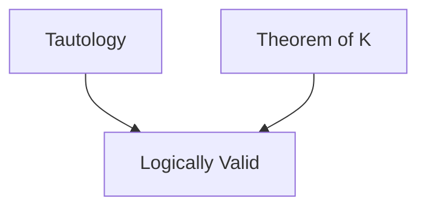

## 前置

- [[数理逻辑/一阶逻辑]]

## 定义

- Fix a first order language $\mathscr{L}$, Define a formal deductive system $K_{\mathscr{L}}$ (abbr. $K$) bythe following axioms and rules of deduction.

  - **Axioms**
    Let $\mathscr{A},\mathscr{B},\mathscr{C}$ be any wfs. of $\mathscr{L}$. The following are axioms of $K_{\mathscr{L}}$:

    - $K(1)$: $(\mathscr{A}\to(\mathscr{B}\to\mathscr{A}))$.
    - $K(2)$: $(\mathscr{A}\to(\mathscr{B}\to\mathscr{C}))\to((\mathscr{A}\to\mathscr{B})\to(\mathscr{A}\to\mathscr{C}))$.
    - $K(3)$: $(\neg\mathscr{A}\to\neg\mathscr{B})\to(\mathscr{B}\to\mathscr{A})$.
    - $K(4)$: $(\forall x_i)\mathscr{A}\to\mathscr{A}$, if $x_i$ does not occur free in $\mathscr{A}$.
    - $K(5)$: $(\forall x_i)\mathscr{A}(x_i)\to\mathscr{A}(t)$, if $\mathscr{A}(x_i)$ is a wf. of $K_{\mathscr{L}}$ and $t$ is a term in $\mathscr{L}$ which is free for $x_i$ in $\mathscr{A}(x_i)$.
    - $K(6)$: $(\forall x_i)(\mathscr{A}\to\mathscr{B})\to(\mathscr{A}\to(\forall x_i)\mathscr{B})$, if $\mathscr{A}$ contains no free occurrence of the variable $x_i$.

  - **Rules**
    - **Modus ponens**(MP): from $\mathscr{A}$ and $(\mathscr{A}\to\mathscr{B})$ deduce $\mathscr{B}$.
    - **Generalisation**: from $\mathscr{A}$ deduce $(\forall x_i)\mathscr{A}$, where $x_i$ is any variable.

- A **proof** in $K_\mathscr{L}$ is a sequence of wfs. $\mathscr{A}_1,\ \mathscr{A}_2,\ \dots,\ \mathscr{A}_n$ such that for each $i\ (1\le i\le n)$, either $\mathscr{A}_i$ is an axiom of $K_\mathscr{L}$ or $\mathscr{A}_i$ follows from previous members of the sequence by MP or Generalisation.
- If $\Gamma$ is a set of wfs. of $\mathscr{L}$, a **deduction from $\Gamma$ in $K_\mathscr{L}$** is a similar sequence, in which members of $\Gamma$ may be included.
- A wf. $\mathscr{A}$ is a **theorem of $K_\mathscr{L}$** if it is the last member of some sequence which constitutes a proof in $K_\mathscr{L}$.
- A wf. $\mathscr{A}$ is a **consequence in $K_\mathscr{L}$ of the set $\Gamma$ of wfs.** if $\mathscr{A}$ is the last member of a sequence which constitutes a deduction from $\Gamma$ in $K_\mathscr{L}$.

- Write$\vdash_{K_\mathscr{L}}\mathscr{A}$ to denote “$\mathscr{A}$ is a theorem of $K_\mathscr{L}$”, and $\Gamma\vdash_{K_\mathscr{L}}\mathscr{A}$ to denote “$\mathscr{A}$ is a consequence in $K_\mathscr{L}$ of $\Gamma$”, where $\Gamma$ is a set of wfs. of $K_\mathscr{L}$.

- For the sake of convenience we shall abbreviate $K_\mathscr{L}$ to $K$ unless there is reason to emphasise the particular language being used.

## 性质

1. If $\mathscr{A}$ is a wf. of $\mathscr{L}$ and $\mathscr{A}$ is tautology, then $\mathscr{A}$ is a theorem of $K_\mathscr{L}$.
2. All instances of axiom schemes (K4), (K5) and (K6) are logically valid.
3. **The Soundness Theorem for K**: For any wf. $\mathscr{A}$ of $\mathscr{L}$, if $\vdash_{K_\mathscr{L}} \mathscr{A}$ then $\mathscr{A}$ is logically valid.
4. **K is consistent** (i.e. for no wf. $\mathscr{A}$ are both $\mathscr{A}$ and $\neg \mathscr{A}$ theorems of K).
