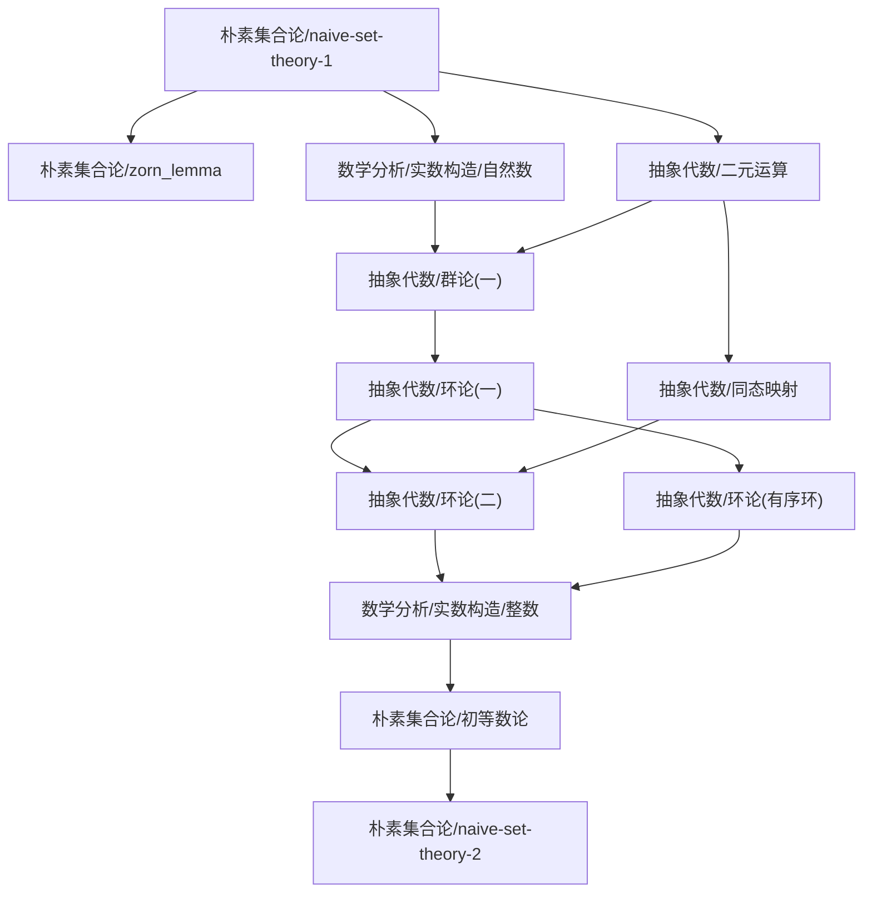

```mermaid
graph TD
1["朴素集合论/naive-set-theory-1"] --> 0["朴素集合论/zorn_lemma"]
3["数学分析/实数构造/整数"] --> 2["朴素集合论/初等数论"]
2["朴素集合论/初等数论"] --> 5["朴素集合论/naive-set-theory-2"]
6["抽象代数/环论(二)"] --> 3["数学分析/实数构造/整数"]
7["抽象代数/环论(有序环)"] --> 3["数学分析/实数构造/整数"]
8["抽象代数/环论(一)"] --> 6["抽象代数/环论(二)"]
9["抽象代数/同态映射"] --> 6["抽象代数/环论(二)"]
8["抽象代数/环论(一)"] --> 7["抽象代数/环论(有序环)"]
10["抽象代数/群论(一)"] --> 8["抽象代数/环论(一)"]
11["数学分析/实数构造/自然数"] --> 10["抽象代数/群论(一)"]
12["抽象代数/二元运算"] --> 10["抽象代数/群论(一)"]
1["朴素集合论/naive-set-theory-1"] --> 11["数学分析/实数构造/自然数"]
1["朴素集合论/naive-set-theory-1"] --> 12["抽象代数/二元运算"]
12["抽象代数/二元运算"] --> 9["抽象代数/同态映射"]
```
