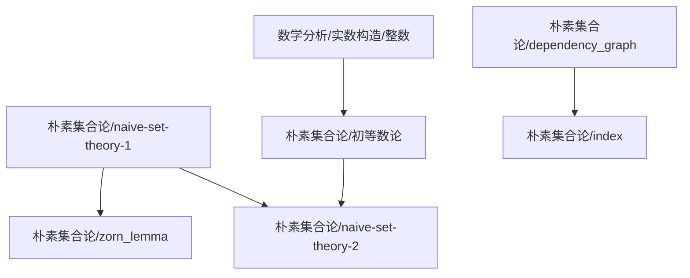

```mermaid
graph TD
1["朴素集合论/naive-set-theory-1"] --> 0["朴素集合论/zorn_lemma"]
3["数学分析/实数构造/整数"] --> 2["朴素集合论/初等数论"]
5["朴素集合论/dependency_graph"] --> 4["朴素集合论/index"]
1["朴素集合论/naive-set-theory-1"] --> 6["朴素集合论/naive-set-theory-2"]
2["朴素集合论/初等数论"] --> 6["朴素集合论/naive-set-theory-2"]
```