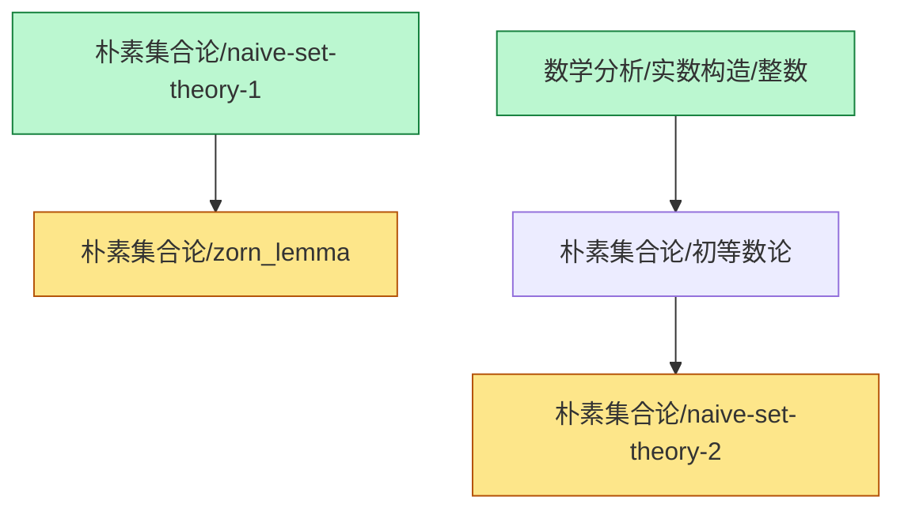

```mermaid
graph TD
1["朴素集合论/naive-set-theory-1"] --> 0["朴素集合论/zorn_lemma"]
3["数学分析/实数构造/整数"] --> 2["朴素集合论/初等数论"]
2["朴素集合论/初等数论"] --> 4["朴素集合论/naive-set-theory-2"]
classDef leaf fill:#fde68a,stroke:#b45309
class 0,4 leaf
classDef foundationRoot fill:#bbf7d0,stroke:#15803d
class 1,3 foundationRoot
```