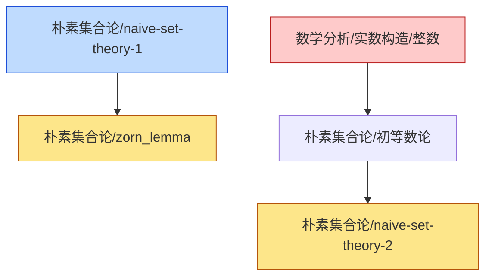

```mermaid
graph TD
1["朴素集合论/naive-set-theory-1"] --> 0["朴素集合论/zorn_lemma"]
3["数学分析/实数构造/整数"] --> 2["朴素集合论/初等数论"]
2["朴素集合论/初等数论"] --> 5["朴素集合论/naive-set-theory-2"]
classDef leaf fill:#fde68a,stroke:#b45309
class 0,5 leaf
classDef root fill:#bfdbfe,stroke:#1d4ed8
class 1,4 root
classDef externalRoot fill:#fecaca,stroke:#b91c1c
class 3 externalRoot
```