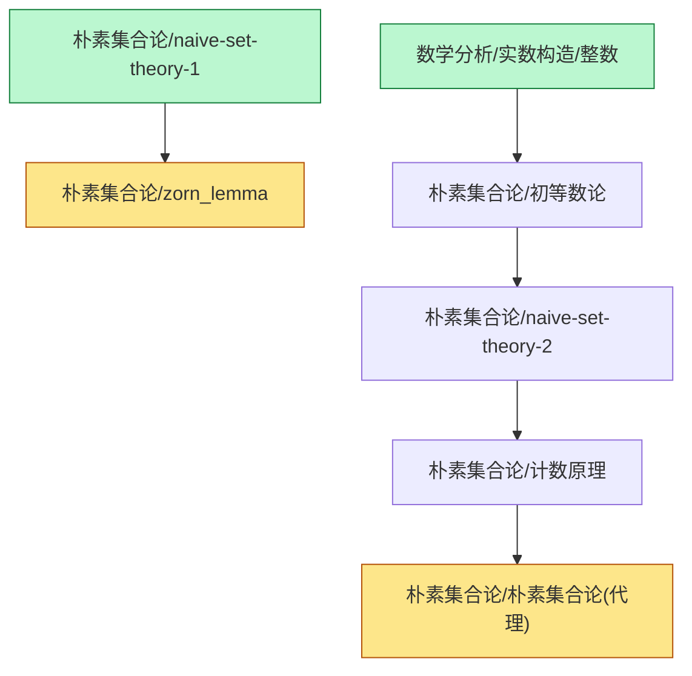

```mermaid
graph TD
1["朴素集合论/naive-set-theory-1"] --> 0["朴素集合论/zorn_lemma"]
3["数学分析/实数构造/整数"] --> 2["朴素集合论/初等数论"]
5["朴素集合论/naive-set-theory-2"] --> 4["朴素集合论/计数原理"]
2["朴素集合论/初等数论"] --> 5["朴素集合论/naive-set-theory-2"]
4["朴素集合论/计数原理"] --> 6["朴素集合论/朴素集合论(代理)"]
classDef leaf fill:#fde68a,stroke:#b45309
class 0,6 leaf
classDef foundationRoot fill:#bbf7d0,stroke:#15803d
class 1,3 foundationRoot
```