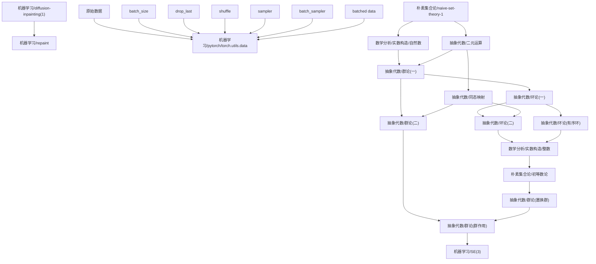

```mermaid
graph TD
1["机器学习/diffusion-inpainting(1)"] --> 0["机器学习/repaint"]
3["抽象代数/群论(群作用)"] --> 2["机器学习/SE(3)"]
6["原始数据"] --> 5["机器学习/pytorch/torch.utils.data"]
7["batch_size"] --> 5["机器学习/pytorch/torch.utils.data"]
8["drop_last"] --> 5["机器学习/pytorch/torch.utils.data"]
9["shuffle"] --> 5["机器学习/pytorch/torch.utils.data"]
10["sampler"] --> 5["机器学习/pytorch/torch.utils.data"]
11["batch_sampler"] --> 5["机器学习/pytorch/torch.utils.data"]
12["batched data"] --> 5["机器学习/pytorch/torch.utils.data"]
13["抽象代数/群论(二)"] --> 3["抽象代数/群论(群作用)"]
14["抽象代数/群论(置换群)"] --> 3["抽象代数/群论(群作用)"]
15["抽象代数/群论(一)"] --> 13["抽象代数/群论(二)"]
16["抽象代数/同态映射"] --> 13["抽象代数/群论(二)"]
17["朴素集合论/初等数论"] --> 14["抽象代数/群论(置换群)"]
18["数学分析/实数构造/整数"] --> 17["朴素集合论/初等数论"]
19["抽象代数/环论(二)"] --> 18["数学分析/实数构造/整数"]
20["抽象代数/环论(有序环)"] --> 18["数学分析/实数构造/整数"]
21["抽象代数/环论(一)"] --> 19["抽象代数/环论(二)"]
16["抽象代数/同态映射"] --> 19["抽象代数/环论(二)"]
21["抽象代数/环论(一)"] --> 20["抽象代数/环论(有序环)"]
15["抽象代数/群论(一)"] --> 21["抽象代数/环论(一)"]
22["数学分析/实数构造/自然数"] --> 15["抽象代数/群论(一)"]
23["抽象代数/二元运算"] --> 15["抽象代数/群论(一)"]
24["朴素集合论/naive-set-theory-1"] --> 22["数学分析/实数构造/自然数"]
24["朴素集合论/naive-set-theory-1"] --> 23["抽象代数/二元运算"]
23["抽象代数/二元运算"] --> 16["抽象代数/同态映射"]
```
