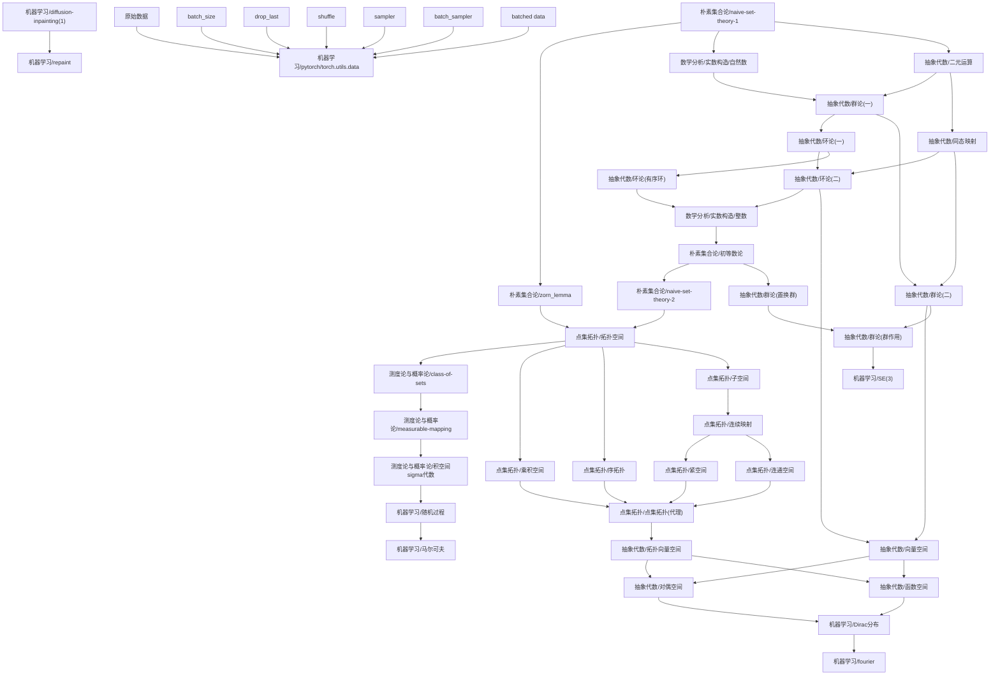

```mermaid
graph TD
1["机器学习/diffusion-inpainting(1)"] --> 0["机器学习/repaint"]
3["抽象代数/群论(群作用)"] --> 2["机器学习/SE(3)"]
5["机器学习/Dirac分布"] --> 4["机器学习/fourier"]
8["机器学习/随机过程"] --> 7["机器学习/马尔可夫"]
9["抽象代数/对偶空间"] --> 5["机器学习/Dirac分布"]
10["抽象代数/函数空间"] --> 5["机器学习/Dirac分布"]
11["测度论与概率论/积空间sigma代数"] --> 8["机器学习/随机过程"]
13["原始数据"] --> 12["机器学习/pytorch/torch.utils.data"]
14["batch_size"] --> 12["机器学习/pytorch/torch.utils.data"]
15["drop_last"] --> 12["机器学习/pytorch/torch.utils.data"]
16["shuffle"] --> 12["机器学习/pytorch/torch.utils.data"]
17["sampler"] --> 12["机器学习/pytorch/torch.utils.data"]
18["batch_sampler"] --> 12["机器学习/pytorch/torch.utils.data"]
19["batched data"] --> 12["机器学习/pytorch/torch.utils.data"]
20["测度论与概率论/measurable-mapping"] --> 11["测度论与概率论/积空间sigma代数"]
21["测度论与概率论/class-of-sets"] --> 20["测度论与概率论/measurable-mapping"]
22["点集拓扑/拓扑空间"] --> 21["测度论与概率论/class-of-sets"]
23["朴素集合论/naive-set-theory-2"] --> 22["点集拓扑/拓扑空间"]
24["朴素集合论/zorn_lemma"] --> 22["点集拓扑/拓扑空间"]
25["朴素集合论/初等数论"] --> 23["朴素集合论/naive-set-theory-2"]
26["朴素集合论/naive-set-theory-1"] --> 24["朴素集合论/zorn_lemma"]
27["数学分析/实数构造/整数"] --> 25["朴素集合论/初等数论"]
28["抽象代数/环论(二)"] --> 27["数学分析/实数构造/整数"]
29["抽象代数/环论(有序环)"] --> 27["数学分析/实数构造/整数"]
30["抽象代数/环论(一)"] --> 28["抽象代数/环论(二)"]
31["抽象代数/同态映射"] --> 28["抽象代数/环论(二)"]
30["抽象代数/环论(一)"] --> 29["抽象代数/环论(有序环)"]
32["抽象代数/群论(一)"] --> 30["抽象代数/环论(一)"]
33["数学分析/实数构造/自然数"] --> 32["抽象代数/群论(一)"]
34["抽象代数/二元运算"] --> 32["抽象代数/群论(一)"]
26["朴素集合论/naive-set-theory-1"] --> 33["数学分析/实数构造/自然数"]
26["朴素集合论/naive-set-theory-1"] --> 34["抽象代数/二元运算"]
34["抽象代数/二元运算"] --> 31["抽象代数/同态映射"]
35["抽象代数/向量空间"] --> 9["抽象代数/对偶空间"]
36["抽象代数/拓扑向量空间"] --> 9["抽象代数/对偶空间"]
35["抽象代数/向量空间"] --> 10["抽象代数/函数空间"]
36["抽象代数/拓扑向量空间"] --> 10["抽象代数/函数空间"]
37["抽象代数/群论(二)"] --> 35["抽象代数/向量空间"]
28["抽象代数/环论(二)"] --> 35["抽象代数/向量空间"]
38["点集拓扑/点集拓扑(代理)"] --> 36["抽象代数/拓扑向量空间"]
39["点集拓扑/紧空间"] --> 38["点集拓扑/点集拓扑(代理)"]
40["点集拓扑/连通空间"] --> 38["点集拓扑/点集拓扑(代理)"]
41["点集拓扑/乘积空间"] --> 38["点集拓扑/点集拓扑(代理)"]
42["点集拓扑/序拓扑"] --> 38["点集拓扑/点集拓扑(代理)"]
43["点集拓扑/连续映射"] --> 39["点集拓扑/紧空间"]
43["点集拓扑/连续映射"] --> 40["点集拓扑/连通空间"]
22["点集拓扑/拓扑空间"] --> 41["点集拓扑/乘积空间"]
22["点集拓扑/拓扑空间"] --> 42["点集拓扑/序拓扑"]
44["点集拓扑/子空间"] --> 43["点集拓扑/连续映射"]
22["点集拓扑/拓扑空间"] --> 44["点集拓扑/子空间"]
32["抽象代数/群论(一)"] --> 37["抽象代数/群论(二)"]
31["抽象代数/同态映射"] --> 37["抽象代数/群论(二)"]
37["抽象代数/群论(二)"] --> 3["抽象代数/群论(群作用)"]
45["抽象代数/群论(置换群)"] --> 3["抽象代数/群论(群作用)"]
25["朴素集合论/初等数论"] --> 45["抽象代数/群论(置换群)"]
```
