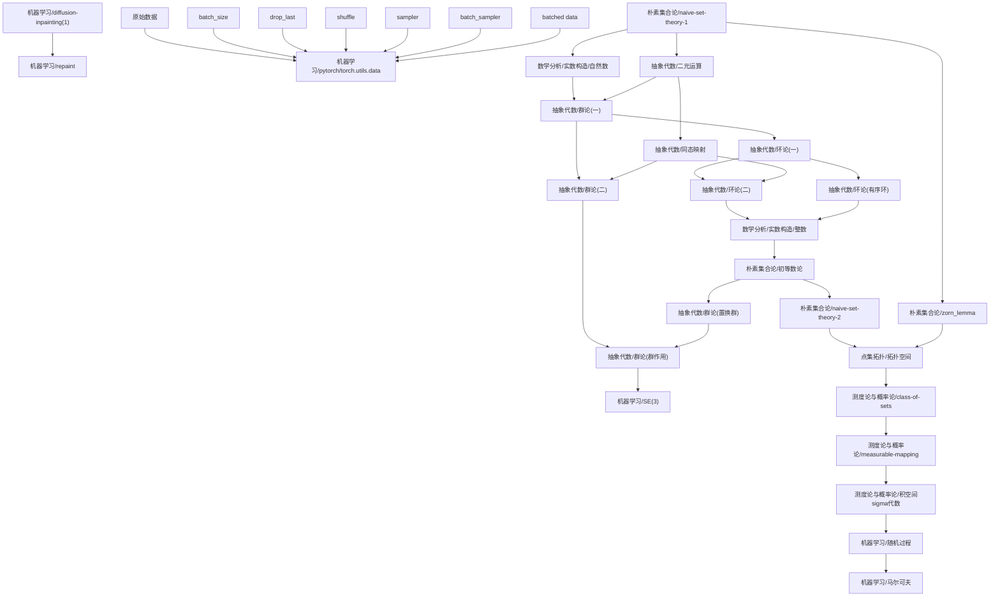

```mermaid
graph TD
1["机器学习/diffusion-inpainting(1)"] --> 0["机器学习/repaint"]
3["抽象代数/群论(群作用)"] --> 2["机器学习/SE(3)"]
6["机器学习/随机过程"] --> 5["机器学习/马尔可夫"]
7["测度论与概率论/积空间sigma代数"] --> 6["机器学习/随机过程"]
9["原始数据"] --> 8["机器学习/pytorch/torch.utils.data"]
10["batch_size"] --> 8["机器学习/pytorch/torch.utils.data"]
11["drop_last"] --> 8["机器学习/pytorch/torch.utils.data"]
12["shuffle"] --> 8["机器学习/pytorch/torch.utils.data"]
13["sampler"] --> 8["机器学习/pytorch/torch.utils.data"]
14["batch_sampler"] --> 8["机器学习/pytorch/torch.utils.data"]
15["batched data"] --> 8["机器学习/pytorch/torch.utils.data"]
16["测度论与概率论/measurable-mapping"] --> 7["测度论与概率论/积空间sigma代数"]
17["测度论与概率论/class-of-sets"] --> 16["测度论与概率论/measurable-mapping"]
18["点集拓扑/拓扑空间"] --> 17["测度论与概率论/class-of-sets"]
19["朴素集合论/naive-set-theory-2"] --> 18["点集拓扑/拓扑空间"]
20["朴素集合论/zorn_lemma"] --> 18["点集拓扑/拓扑空间"]
21["朴素集合论/初等数论"] --> 19["朴素集合论/naive-set-theory-2"]
22["朴素集合论/naive-set-theory-1"] --> 20["朴素集合论/zorn_lemma"]
23["数学分析/实数构造/整数"] --> 21["朴素集合论/初等数论"]
24["抽象代数/环论(二)"] --> 23["数学分析/实数构造/整数"]
25["抽象代数/环论(有序环)"] --> 23["数学分析/实数构造/整数"]
26["抽象代数/环论(一)"] --> 24["抽象代数/环论(二)"]
27["抽象代数/同态映射"] --> 24["抽象代数/环论(二)"]
26["抽象代数/环论(一)"] --> 25["抽象代数/环论(有序环)"]
28["抽象代数/群论(一)"] --> 26["抽象代数/环论(一)"]
29["数学分析/实数构造/自然数"] --> 28["抽象代数/群论(一)"]
30["抽象代数/二元运算"] --> 28["抽象代数/群论(一)"]
22["朴素集合论/naive-set-theory-1"] --> 29["数学分析/实数构造/自然数"]
22["朴素集合论/naive-set-theory-1"] --> 30["抽象代数/二元运算"]
30["抽象代数/二元运算"] --> 27["抽象代数/同态映射"]
31["抽象代数/群论(二)"] --> 3["抽象代数/群论(群作用)"]
32["抽象代数/群论(置换群)"] --> 3["抽象代数/群论(群作用)"]
28["抽象代数/群论(一)"] --> 31["抽象代数/群论(二)"]
27["抽象代数/同态映射"] --> 31["抽象代数/群论(二)"]
21["朴素集合论/初等数论"] --> 32["抽象代数/群论(置换群)"]
```
