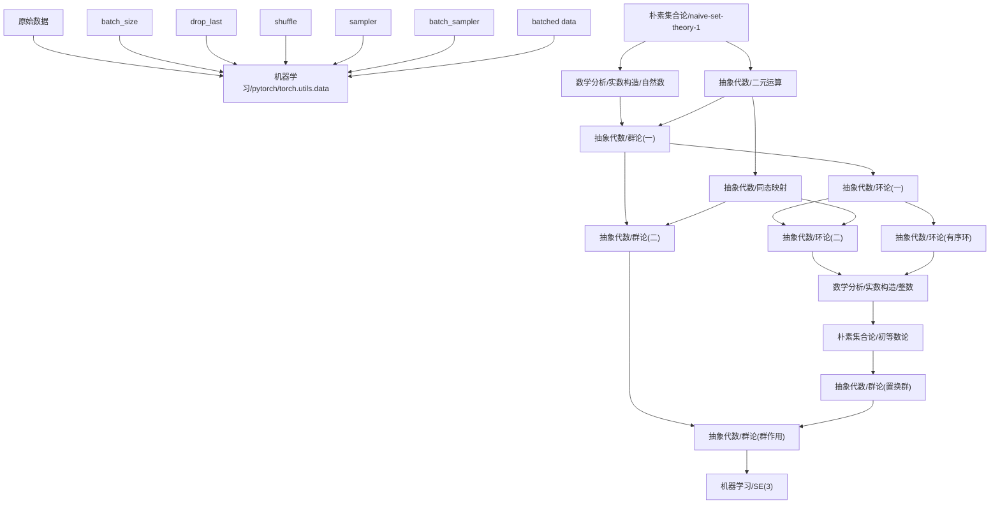

```mermaid
graph TD
1["抽象代数/群论(群作用)"] --> 0["机器学习/SE(3)"]
4["原始数据"] --> 3["机器学习/pytorch/torch.utils.data"]
5["batch_size"] --> 3["机器学习/pytorch/torch.utils.data"]
6["drop_last"] --> 3["机器学习/pytorch/torch.utils.data"]
7["shuffle"] --> 3["机器学习/pytorch/torch.utils.data"]
8["sampler"] --> 3["机器学习/pytorch/torch.utils.data"]
9["batch_sampler"] --> 3["机器学习/pytorch/torch.utils.data"]
10["batched data"] --> 3["机器学习/pytorch/torch.utils.data"]
11["抽象代数/群论(二)"] --> 1["抽象代数/群论(群作用)"]
12["抽象代数/群论(置换群)"] --> 1["抽象代数/群论(群作用)"]
13["抽象代数/群论(一)"] --> 11["抽象代数/群论(二)"]
14["抽象代数/同态映射"] --> 11["抽象代数/群论(二)"]
15["朴素集合论/初等数论"] --> 12["抽象代数/群论(置换群)"]
16["数学分析/实数构造/整数"] --> 15["朴素集合论/初等数论"]
17["抽象代数/环论(二)"] --> 16["数学分析/实数构造/整数"]
18["抽象代数/环论(有序环)"] --> 16["数学分析/实数构造/整数"]
19["抽象代数/环论(一)"] --> 17["抽象代数/环论(二)"]
14["抽象代数/同态映射"] --> 17["抽象代数/环论(二)"]
19["抽象代数/环论(一)"] --> 18["抽象代数/环论(有序环)"]
13["抽象代数/群论(一)"] --> 19["抽象代数/环论(一)"]
20["数学分析/实数构造/自然数"] --> 13["抽象代数/群论(一)"]
21["抽象代数/二元运算"] --> 13["抽象代数/群论(一)"]
22["朴素集合论/naive-set-theory-1"] --> 20["数学分析/实数构造/自然数"]
22["朴素集合论/naive-set-theory-1"] --> 21["抽象代数/二元运算"]
21["抽象代数/二元运算"] --> 14["抽象代数/同态映射"]
```
