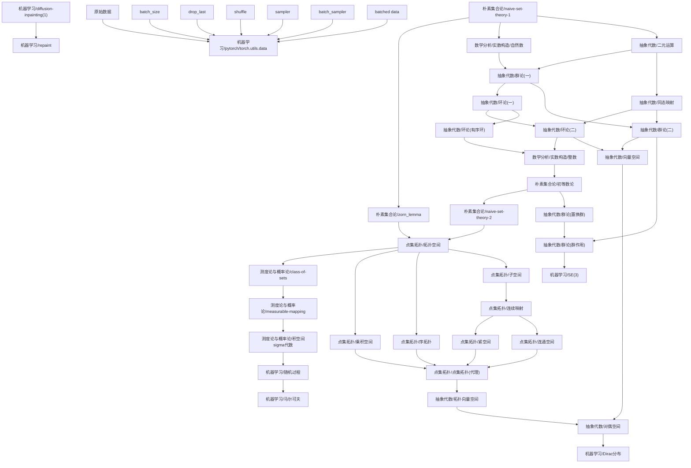

```mermaid
graph TD
1["机器学习/diffusion-inpainting(1)"] --> 0["机器学习/repaint"]
3["抽象代数/群论(群作用)"] --> 2["机器学习/SE(3)"]
6["机器学习/随机过程"] --> 5["机器学习/马尔可夫"]
8["抽象代数/对偶空间"] --> 7["机器学习/Dirac分布"]
9["测度论与概率论/积空间sigma代数"] --> 6["机器学习/随机过程"]
11["原始数据"] --> 10["机器学习/pytorch/torch.utils.data"]
12["batch_size"] --> 10["机器学习/pytorch/torch.utils.data"]
13["drop_last"] --> 10["机器学习/pytorch/torch.utils.data"]
14["shuffle"] --> 10["机器学习/pytorch/torch.utils.data"]
15["sampler"] --> 10["机器学习/pytorch/torch.utils.data"]
16["batch_sampler"] --> 10["机器学习/pytorch/torch.utils.data"]
17["batched data"] --> 10["机器学习/pytorch/torch.utils.data"]
18["测度论与概率论/measurable-mapping"] --> 9["测度论与概率论/积空间sigma代数"]
19["测度论与概率论/class-of-sets"] --> 18["测度论与概率论/measurable-mapping"]
20["点集拓扑/拓扑空间"] --> 19["测度论与概率论/class-of-sets"]
21["朴素集合论/naive-set-theory-2"] --> 20["点集拓扑/拓扑空间"]
22["朴素集合论/zorn_lemma"] --> 20["点集拓扑/拓扑空间"]
23["朴素集合论/初等数论"] --> 21["朴素集合论/naive-set-theory-2"]
24["朴素集合论/naive-set-theory-1"] --> 22["朴素集合论/zorn_lemma"]
25["数学分析/实数构造/整数"] --> 23["朴素集合论/初等数论"]
26["抽象代数/环论(二)"] --> 25["数学分析/实数构造/整数"]
27["抽象代数/环论(有序环)"] --> 25["数学分析/实数构造/整数"]
28["抽象代数/环论(一)"] --> 26["抽象代数/环论(二)"]
29["抽象代数/同态映射"] --> 26["抽象代数/环论(二)"]
28["抽象代数/环论(一)"] --> 27["抽象代数/环论(有序环)"]
30["抽象代数/群论(一)"] --> 28["抽象代数/环论(一)"]
31["数学分析/实数构造/自然数"] --> 30["抽象代数/群论(一)"]
32["抽象代数/二元运算"] --> 30["抽象代数/群论(一)"]
24["朴素集合论/naive-set-theory-1"] --> 31["数学分析/实数构造/自然数"]
24["朴素集合论/naive-set-theory-1"] --> 32["抽象代数/二元运算"]
32["抽象代数/二元运算"] --> 29["抽象代数/同态映射"]
33["抽象代数/向量空间"] --> 8["抽象代数/对偶空间"]
34["抽象代数/拓扑向量空间"] --> 8["抽象代数/对偶空间"]
35["抽象代数/群论(二)"] --> 33["抽象代数/向量空间"]
26["抽象代数/环论(二)"] --> 33["抽象代数/向量空间"]
36["点集拓扑/点集拓扑(代理)"] --> 34["抽象代数/拓扑向量空间"]
37["点集拓扑/紧空间"] --> 36["点集拓扑/点集拓扑(代理)"]
38["点集拓扑/连通空间"] --> 36["点集拓扑/点集拓扑(代理)"]
39["点集拓扑/乘积空间"] --> 36["点集拓扑/点集拓扑(代理)"]
40["点集拓扑/序拓扑"] --> 36["点集拓扑/点集拓扑(代理)"]
41["点集拓扑/连续映射"] --> 37["点集拓扑/紧空间"]
41["点集拓扑/连续映射"] --> 38["点集拓扑/连通空间"]
20["点集拓扑/拓扑空间"] --> 39["点集拓扑/乘积空间"]
20["点集拓扑/拓扑空间"] --> 40["点集拓扑/序拓扑"]
42["点集拓扑/子空间"] --> 41["点集拓扑/连续映射"]
20["点集拓扑/拓扑空间"] --> 42["点集拓扑/子空间"]
30["抽象代数/群论(一)"] --> 35["抽象代数/群论(二)"]
29["抽象代数/同态映射"] --> 35["抽象代数/群论(二)"]
35["抽象代数/群论(二)"] --> 3["抽象代数/群论(群作用)"]
43["抽象代数/群论(置换群)"] --> 3["抽象代数/群论(群作用)"]
23["朴素集合论/初等数论"] --> 43["抽象代数/群论(置换群)"]
```
