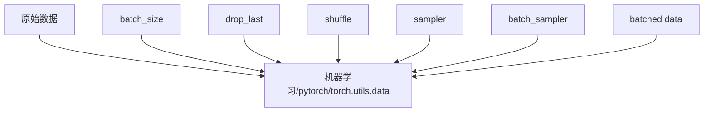

```mermaid
graph TD
2["原始数据"] --> 1["机器学习/pytorch/torch.utils.data"]
3["batch_size"] --> 1["机器学习/pytorch/torch.utils.data"]
4["drop_last"] --> 1["机器学习/pytorch/torch.utils.data"]
5["shuffle"] --> 1["机器学习/pytorch/torch.utils.data"]
6["sampler"] --> 1["机器学习/pytorch/torch.utils.data"]
7["batch_sampler"] --> 1["机器学习/pytorch/torch.utils.data"]
8["batched data"] --> 1["机器学习/pytorch/torch.utils.data"]
```