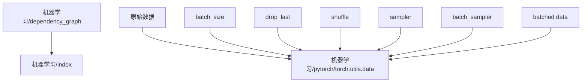

```mermaid
graph TD
1["机器学习/dependency_graph"] --> 0["机器学习/index"]
3["原始数据"] --> 2["机器学习/pytorch/torch.utils.data"]
4["batch_size"] --> 2["机器学习/pytorch/torch.utils.data"]
5["drop_last"] --> 2["机器学习/pytorch/torch.utils.data"]
6["shuffle"] --> 2["机器学习/pytorch/torch.utils.data"]
7["sampler"] --> 2["机器学习/pytorch/torch.utils.data"]
8["batch_sampler"] --> 2["机器学习/pytorch/torch.utils.data"]
9["batched data"] --> 2["机器学习/pytorch/torch.utils.data"]
```