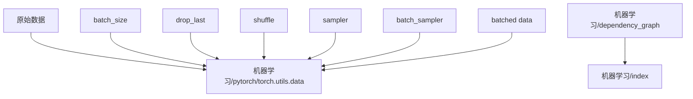

```mermaid
graph TD
1["原始数据"] --> 0["机器学习/pytorch/torch.utils.data"]
2["batch_size"] --> 0["机器学习/pytorch/torch.utils.data"]
3["drop_last"] --> 0["机器学习/pytorch/torch.utils.data"]
4["shuffle"] --> 0["机器学习/pytorch/torch.utils.data"]
5["sampler"] --> 0["机器学习/pytorch/torch.utils.data"]
6["batch_sampler"] --> 0["机器学习/pytorch/torch.utils.data"]
7["batched data"] --> 0["机器学习/pytorch/torch.utils.data"]
9["机器学习/dependency_graph"] --> 8["机器学习/index"]
```