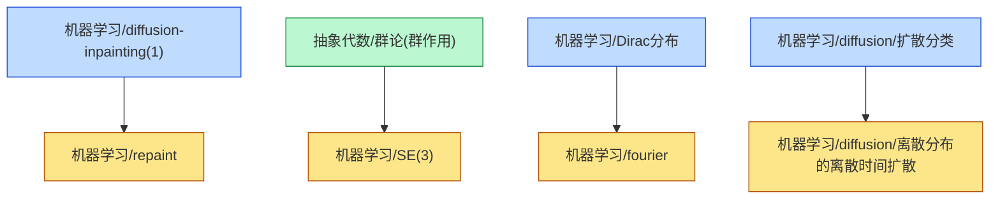

```mermaid
graph TD
1["机器学习/diffusion-inpainting(1)"] --> 0["机器学习/repaint"]
3["抽象代数/群论(群作用)"] --> 2["机器学习/SE(3)"]
5["机器学习/Dirac分布"] --> 4["机器学习/fourier"]
7["机器学习/diffusion/扩散分类"] --> 6["机器学习/diffusion/离散分布的离散时间扩散"]
classDef leaf fill:#fde68a,stroke:#b45309
class 0,2,4,6 leaf
classDef root fill:#bfdbfe,stroke:#1d4ed8
class 1,5,7 root
classDef foundationRoot fill:#bbf7d0,stroke:#15803d
class 3 foundationRoot
```