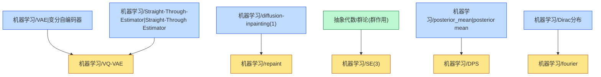

```mermaid
graph TD
1["机器学习/VAE|变分自编码器"] --> 0["机器学习/VQ-VAE"]
2["机器学习/Straight-Through-Estimator|Straight-Through Estimator"] --> 0["机器学习/VQ-VAE"]
4["机器学习/diffusion-inpainting(1)"] --> 3["机器学习/repaint"]
6["抽象代数/群论(群作用)"] --> 5["机器学习/SE(3)"]
8["机器学习/posterior_mean|posterior mean"] --> 7["机器学习/DPS"]
10["机器学习/Dirac分布"] --> 9["机器学习/fourier"]
classDef leaf fill:#fde68a,stroke:#b45309
class 0,3,5,7,9 leaf
classDef root fill:#bfdbfe,stroke:#1d4ed8
class 1,2,4,8,10 root
classDef foundationRoot fill:#bbf7d0,stroke:#15803d
class 6 foundationRoot
```