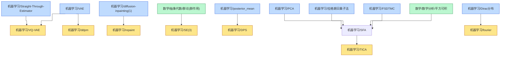

```mermaid
%%{init: {'flowchart': {'curve': 'stepAfter'}}}%%
graph TD
1["机器学习/VAE"] --> 0["机器学习/VQ-VAE"]
2["机器学习/Straight-Through-Estimator"] --> 0["机器学习/VQ-VAE"]
4["机器学习/diffusion-inpainting(1)"] --> 3["机器学习/repaint"]
6["数学/抽象代数/群论(群作用)"] --> 5["机器学习/SE(3)"]
1["机器学习/VAE"] --> 7["机器学习/ddpm"]
9["机器学习/posterior_mean"] --> 8["机器学习/DPS"]
11["机器学习/SFA"] --> 10["机器学习/TICA"]
13["机器学习/Dirac分布"] --> 12["机器学习/fourier"]
14["机器学习/PCA"] --> 11["机器学习/SFA"]
15["机器学习/拉格朗日乘子法"] --> 11["机器学习/SFA"]
16["机器学习/FSDTMC"] --> 11["机器学习/SFA"]
17["数学/数学分析/平方可积"] --> 11["机器学习/SFA"]
classDef leaf fill:#fde68a,stroke:#b45309
class 0,3,5,7,8,10,12 leaf
classDef root fill:#bfdbfe,stroke:#1d4ed8
class 1,2,4,9,13,14,15,16 root
classDef foundationRoot fill:#bbf7d0,stroke:#15803d
class 6,17 foundationRoot
click 0 "/机器学习/vq-vae" "机器学习/VQ-VAE"
click 1 "/机器学习/vae" "机器学习/VAE"
click 2 "/机器学习/straight-through-estimator" "机器学习/Straight-Through-Estimator"
click 3 "/机器学习/repaint" "机器学习/repaint"
click 4 "/机器学习/diffusion-inpainting(1)" "机器学习/diffusion-inpainting(1)"
click 5 "/机器学习/se(3)" "机器学习/SE(3)"
click 6 "/数学/抽象代数/群论(群作用)" "数学/抽象代数/群论(群作用)"
click 7 "/机器学习/ddpm" "机器学习/ddpm"
click 8 "/机器学习/dps" "机器学习/DPS"
click 9 "/机器学习/posterior_mean" "机器学习/posterior_mean"
click 10 "/机器学习/tica" "机器学习/TICA"
click 11 "/机器学习/sfa" "机器学习/SFA"
click 12 "/机器学习/fourier" "机器学习/fourier"
click 13 "/机器学习/dirac分布" "机器学习/Dirac分布"
click 14 "/机器学习/pca" "机器学习/PCA"
click 15 "/机器学习/拉格朗日乘子法" "机器学习/拉格朗日乘子法"
click 16 "/机器学习/fsdtmc" "机器学习/FSDTMC"
click 17 "/数学/数学分析/平方可积" "数学/数学分析/平方可积"
```