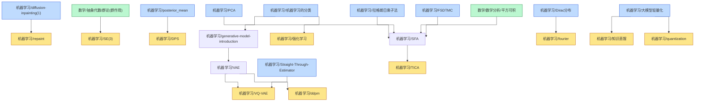

```mermaid
%%{init: {'flowchart': {'curve': 'stepAfter'}}}%%
graph TD
1["机器学习/机器学习的分类"] --> 0["机器学习/generative-model-introduction"]
3["机器学习/VAE"] --> 2["机器学习/VQ-VAE"]
4["机器学习/Straight-Through-Estimator"] --> 2["机器学习/VQ-VAE"]
6["机器学习/diffusion-inpainting(1)"] --> 5["机器学习/repaint"]
8["数学/抽象代数/群论(群作用)"] --> 7["机器学习/SE(3)"]
0["机器学习/generative-model-introduction"] --> 3["机器学习/VAE"]
3["机器学习/VAE"] --> 9["机器学习/ddpm"]
11["机器学习/posterior_mean"] --> 10["机器学习/DPS"]
13["机器学习/SFA"] --> 12["机器学习/TICA"]
15["机器学习/Dirac分布"] --> 14["机器学习/fourier"]
17["机器学习/大模型轻量化"] --> 16["机器学习/知识蒸馏"]
1["机器学习/机器学习的分类"] --> 18["机器学习/强化学习"]
19["机器学习/PCA"] --> 13["机器学习/SFA"]
20["机器学习/拉格朗日乘子法"] --> 13["机器学习/SFA"]
21["机器学习/FSDTMC"] --> 13["机器学习/SFA"]
22["数学/数学分析/平方可积"] --> 13["机器学习/SFA"]
17["机器学习/大模型轻量化"] --> 23["机器学习/quantization"]
classDef leaf fill:#fde68a,stroke:#b45309
class 2,5,7,9,10,12,14,16,18,23 leaf
classDef root fill:#bfdbfe,stroke:#1d4ed8
class 1,4,6,11,15,17,19,20,21 root
classDef foundationRoot fill:#bbf7d0,stroke:#15803d
class 8,22 foundationRoot
click 0 "/机器学习/generative-model-introduction" "机器学习/generative-model-introduction"
click 1 "/机器学习/机器学习的分类" "机器学习/机器学习的分类"
click 2 "/机器学习/vq-vae" "机器学习/VQ-VAE"
click 3 "/机器学习/vae" "机器学习/VAE"
click 4 "/机器学习/straight-through-estimator" "机器学习/Straight-Through-Estimator"
click 5 "/机器学习/repaint" "机器学习/repaint"
click 6 "/机器学习/diffusion-inpainting(1)" "机器学习/diffusion-inpainting(1)"
click 7 "/机器学习/se(3)" "机器学习/SE(3)"
click 8 "/数学/抽象代数/群论(群作用)" "数学/抽象代数/群论(群作用)"
click 9 "/机器学习/ddpm" "机器学习/ddpm"
click 10 "/机器学习/dps" "机器学习/DPS"
click 11 "/机器学习/posterior_mean" "机器学习/posterior_mean"
click 12 "/机器学习/tica" "机器学习/TICA"
click 13 "/机器学习/sfa" "机器学习/SFA"
click 14 "/机器学习/fourier" "机器学习/fourier"
click 15 "/机器学习/dirac分布" "机器学习/Dirac分布"
click 16 "/机器学习/知识蒸馏" "机器学习/知识蒸馏"
click 17 "/机器学习/大模型轻量化" "机器学习/大模型轻量化"
click 18 "/机器学习/强化学习" "机器学习/强化学习"
click 19 "/机器学习/pca" "机器学习/PCA"
click 20 "/机器学习/拉格朗日乘子法" "机器学习/拉格朗日乘子法"
click 21 "/机器学习/fsdtmc" "机器学习/FSDTMC"
click 22 "/数学/数学分析/平方可积" "数学/数学分析/平方可积"
click 23 "/机器学习/quantization" "机器学习/quantization"
```