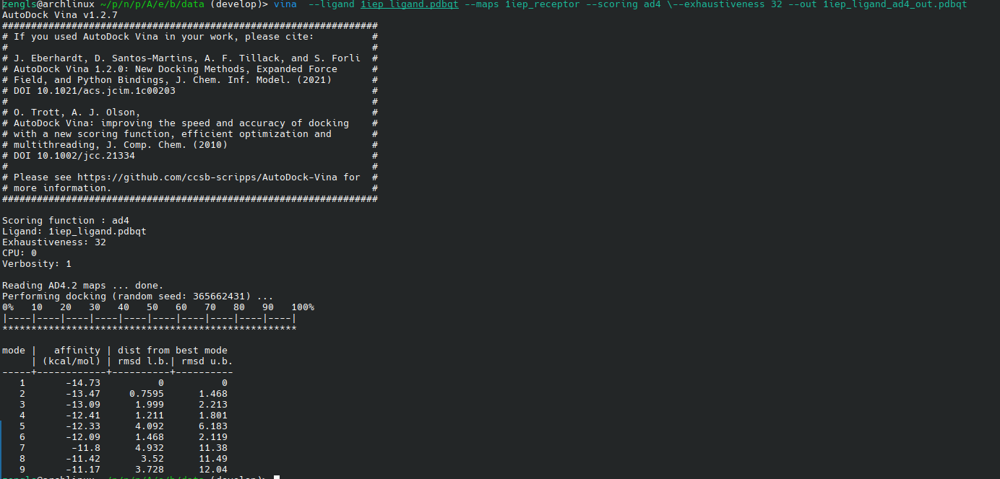
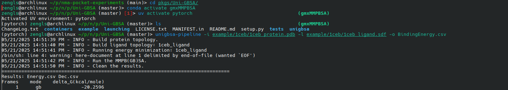
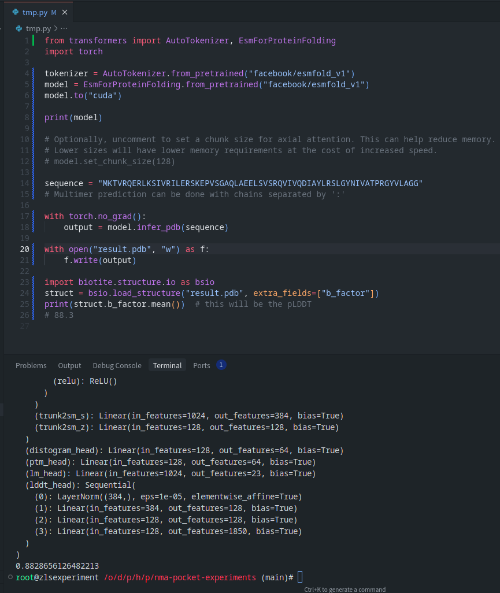

---
蛋白质口袋评估指标
---

- [Vina Score](#vina-score)
	- [原理](#原理)
	- [网址](#网址)
	- [安装过程](#安装过程)
	- [使用](#使用)
	- [效果](#效果)
	- [完整的安装脚本](#完整的安装脚本)
- [UniGSSA](#unigssa)
	- [原理](#原理-1)
	- [安装流程](#安装流程)
	- [使用](#使用-1)
	- [效果](#效果-1)
- [scRMSD](#scrmsd)
	- [scRMSD](#scrmsd-1)

# Vina Score

## 原理

对配体和受体的假设：

- 不变的
  - protonation state and charge distribution of molecules
  - rigid, the covalent lengths and angles constant of the receptor
- 可变的
  - 配体的部分的共价键可以旋转
  - 配体的整体可以旋转和平移

$
  c = \sum_{i<j} f_{t_i,t_j} (r_{ij}),
$
$c$ 可以拆成两部分，分子间的和(配体)分子内的
$
  c = c_{inter} + c_{intra}
$

全局扰动+局部搜索， 得到若干结合构象，按总能量排序$(c_i)_{i=1}^n$，将总能量最小的构象的配体分子内能量记作$c_{intra1}$ 然后计算 Vina 得分
$
  s_i = c_i - c_{intra1}
$

vina 分数取$(s_i)_{i=1}^n$ 的最小值。

## 网址

```
https://autodock-vina.readthedocs.io/en/latest/index.html#
```

## 安装过程

下载 vina 可执行程序

```bash
wget https://github.com/ccsb-scripps/AutoDock-Vina/releases/download/v1.2.7/vina_1.2.7_linux_x86_64
```

(安装 vina python 包)

```
uv pip install vina
```

安装输入预处理包

- Meeko

```
pip install numpy scipy rdkit  meeko
pip install git+https://github.com/prody/ProDy
```

- AutoGrid4

```
https://github.com/ccsb-scripps/AutoGrid.git
```

- ADFR software suite

```
https://ccsb.scripps.edu/adfr/downloads/
```

## 使用

```
https://autodock-vina.readthedocs.io/en/latest/docking_basic.html
```

## 效果



## 完整的安装脚本

```bash
set -e
set -x

rm -rf metrics/vina

# check an mkdir
dir_name="metrics/vina"
if [ ! -d $dir_name ]; then
    echo "mkdir $dir_name"
    mkdir -p $dir_name
fi

cd $dir_name

# vina
wget https://github.com/ccsb-scripps/AutoDock-Vina/releases/download/v1.2.7/vina_1.2.7_linux_x86_64
chmod 700 vina_1.2.7_linux_x86_64
ln -s $(pwd)/vina_1.2.7_linux_x86_64 vina
pip install vina
# meeko
pip install numpy scipy rdkit meeko
pip install git+https://github.com/prody/prody
# AutoGrid
git clone https://github.com/ccsb-scripps/AutoGrid
cd AutoGrid
autoreconf -i
mkdir Linux64
cd Linux64
../configure
make
cd ../..
# ADFR
wget https://ccsb.scripps.edu/adfr/download/1038/ -O adfr.tar.gz
tar -zxvf adfr.tar.gz
cd ADFRsuite_x86_64Linux_1.0
printf "yes\n" | ./install.sh -d Linux64 -c 0
cd ..
add_to_path_config $(pwd)/ADFRsuite_x86_64Linux_1.0/Linux64/bin
add_to_path_config $(pwd)/AutoGrid/Linux64
add_to_path_config $(pwd)
```

---

# UniGSSA

## 原理

计算配体受体互作前后体系的自由能变化。

## 安装流程

依赖：gmxMMPBSA

```bash
wget https://valdes-tresanco-ms.github.io/gmx_MMPBSA/dev/env.yml
conda env create --file env.yml
conda activate gmxMMPBSA
```

unigbsa

```bash
uv pip install unigbsa lickit
```

## 使用

```bash
unigbsa-pipeline -i example/1ceb/1ceb_protein.pdb -l example/1ceb/1ceb_ligand.sdf -o BindingEnergy.csv
```

## 效果



---

# scRMSD

## scRMSD

self-consistency root mean square deviation

检查设计出的结构能否自洽地被当前的结构预测工具所再现。

- 使用模型生成一个蛋白质结构
- 然后用 ProteinMPNN 设计出氨基酸序列
- 再用结构预测工具（如 AlphaFold2 或 ESMFold）从这个序列反推出结构，
- 最后比对原始生成结构与预测结构的一致性。


