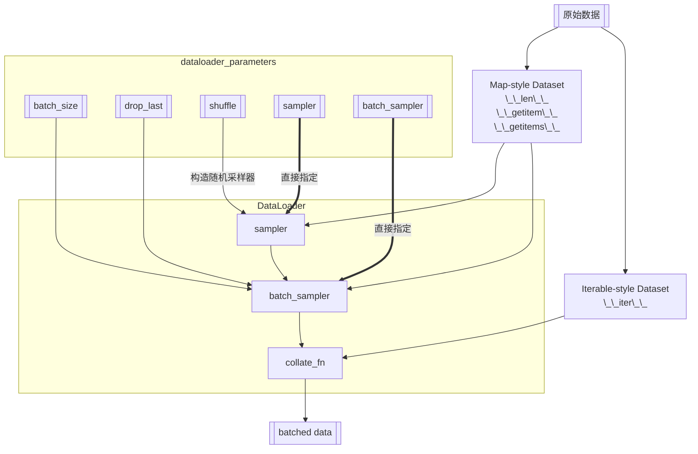

- [1. 数据流](#1-数据流)
- [2. 说明 for Map-style Dataset](#2-说明-for-map-style-dataset)
  - [2.1. collate\_fn](#21-collate_fn)
  - [2.2. 直接指定](#22-直接指定)
- [3. 测试程序](#3-测试程序)
- [4. 参考资料](#4-参考资料)

## 1. 数据流



## 2. 说明 for Map-style Dataset

### 2.1. collate_fn

`collate_fn`的输入是一个样本列表，作用类似于下面这样。

```python
for indices in batch_sampler:
    yield collate_fn([dataset[i] for i in indices])
```

如果不设置`batch_size` and `batch_sampler`, 即禁用自动batching
就等价于

```python
for index in sampler:
    yield collate_fn(dataset[index])
```

如果不提供`collate_fn`, pytorch会应用一个默认的`collate_fn`， 默认的`collate_fn`有如下性质

- 如果没有禁用自动batching
  - It always prepends a new dimension as the batch dimension.
  - It automatically converts NumPy arrays and Python numerical values into PyTorch Tensors.
  - It preserves the data structure, e.g., if each sample is a dictionary, it outputs a dictionary with the same set of keys but batched Tensors as values (or lists if the values can not be converted into Tensors). Same for list s, tuple s, namedtuple s, etc.
- 如果禁用自动batching
  - It automatically converts NumPy arrays and Python numerical values into PyTorch Tensors.

### 2.2. 直接指定

`直接指定`某个参数后，就不需要(禁止)再提供额外的参数来构造该对象了。例如
`直接指定` `sampler`后就不能再输入`shuffle`了
`直接指定` `batch_sampler`后就不能再输入`batch_size`, `drop_last`, `shuffle`, `sampler`了

## 3. 测试程序

```python
from torch.utils.data import Dataset, DataLoader
import torch

from torch.utils.data import Sampler
from typing import Iterator, List


class EvenThenOddSampler(Sampler[int]):
    def __init__(self, data_source) -> None:
        self.data_source = data_source

    def __len__(self) -> int:
        return len(self.data_source)

    def __iter__(self) -> Iterator[int]:
        print("__iter__ is called")
        n = len(self.data_source)

        for i in range(0, n, 2):
            yield i

        for i in range(1, n, 2):
            yield i


class EvenThenOddBatchSampler(Sampler[List[int]]):
    def __init__(self, data_source, batch_size: int, drop_last: bool = False):
        self.data_source = data_source
        self.batch_size = batch_size
        self.drop_last = drop_last

    def __len__(self) -> int:
        n = len(self.data_source)
        if self.drop_last:
            return n // self.batch_size
        else:
            return (n + self.batch_size - 1) // self.batch_size

    def __iter__(self) -> Iterator[List[int]]:
        print("__iter__ is called")
        n = len(self.data_source)

        indices = list(range(0, n, 2)) + list(range(1, n, 2))

        batch = []
        for idx in indices:
            batch.append(idx)
            if len(batch) == self.batch_size:
                yield batch
                batch = []

        if len(batch) > 0 and not self.drop_last:
            yield batch


class MyDataset(Dataset):
    def __init__(self):
        super().__init__()
        self.data = torch.arange(0, 64)
        self.labels = torch.arange(0, 64) * 10

    def __getitem__(self, idx):
        print(f"__getitem__ is called with idx {idx}")
        return self.data[idx], self.labels[idx]

    def __len__(self):
        print(f"__len__ is called")
        return len(self.data)

    # def __getitems__(self, idxs):
    #     print(f"__getitems__ is called with idxs {idxs}")
    #     datalist = []
    #     for idx in idxs:
    #         datalist.append((self.data[idx], self.labels[idx]))
    #     return datalist


train_dataset = MyDataset()

sampler = EvenThenOddSampler(train_dataset)
batch_sampler = EvenThenOddBatchSampler(train_dataset, batch_size=4, drop_last=False)

print("dataloader is created")

dataloader = DataLoader(
    train_dataset,
    # batch_size=4,
    # shuffle=True,
    # sampler=sampler,
    batch_sampler=batch_sampler,
    num_workers=0,
    collate_fn=None,
    pin_memory=False,
    drop_last=False,
)

for batch in dataloader:
    print(batch)

```

## 4. 参考资料

```
https://docs.pytorch.org/docs/2.6/data
```
