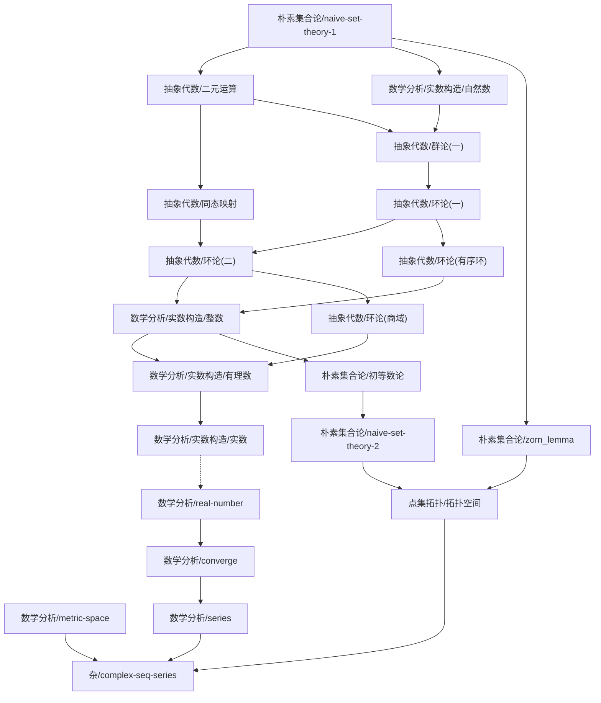

```mermaid
graph TD
1["数学分析/metric-space"] --> 0["杂/complex-seq-series"]
2["点集拓扑/拓扑空间"] --> 0["杂/complex-seq-series"]
3["数学分析/series"] --> 0["杂/complex-seq-series"]
5["朴素集合论/naive-set-theory-2"] --> 2["点集拓扑/拓扑空间"]
6["朴素集合论/zorn_lemma"] --> 2["点集拓扑/拓扑空间"]
7["数学分析/converge"] --> 3["数学分析/series"]
8["数学分析/real-number"] --> 7["数学分析/converge"]
9["数学分析/实数构造/实数"] -.-> 8["数学分析/real-number"]
10["数学分析/实数构造/有理数"] --> 9["数学分析/实数构造/实数"]
11["数学分析/实数构造/整数"] --> 10["数学分析/实数构造/有理数"]
12["抽象代数/环论(商域)"] --> 10["数学分析/实数构造/有理数"]
13["抽象代数/环论(二)"] --> 11["数学分析/实数构造/整数"]
14["抽象代数/环论(有序环)"] --> 11["数学分析/实数构造/整数"]
13["抽象代数/环论(二)"] --> 12["抽象代数/环论(商域)"]
15["抽象代数/环论(一)"] --> 13["抽象代数/环论(二)"]
16["抽象代数/同态映射"] --> 13["抽象代数/环论(二)"]
17["抽象代数/群论(一)"] --> 15["抽象代数/环论(一)"]
18["抽象代数/二元运算"] --> 16["抽象代数/同态映射"]
19["朴素集合论/naive-set-theory-1"] --> 18["抽象代数/二元运算"]
20["数学分析/实数构造/自然数"] --> 17["抽象代数/群论(一)"]
18["抽象代数/二元运算"] --> 17["抽象代数/群论(一)"]
19["朴素集合论/naive-set-theory-1"] --> 20["数学分析/实数构造/自然数"]
15["抽象代数/环论(一)"] --> 14["抽象代数/环论(有序环)"]
21["朴素集合论/初等数论"] --> 5["朴素集合论/naive-set-theory-2"]
19["朴素集合论/naive-set-theory-1"] --> 6["朴素集合论/zorn_lemma"]
11["数学分析/实数构造/整数"] --> 21["朴素集合论/初等数论"]
```
