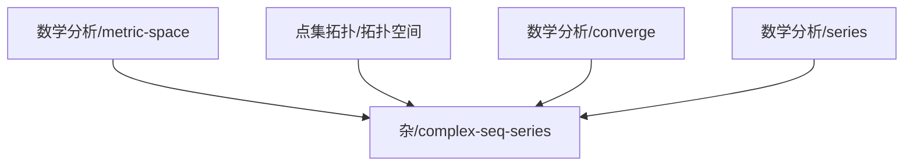

```mermaid
graph TD
1["数学分析/metric-space"] --> 0["杂/complex-seq-series"]
2["点集拓扑/拓扑空间"] --> 0["杂/complex-seq-series"]
3["数学分析/converge"] --> 0["杂/complex-seq-series"]
4["数学分析/series"] --> 0["杂/complex-seq-series"]
```