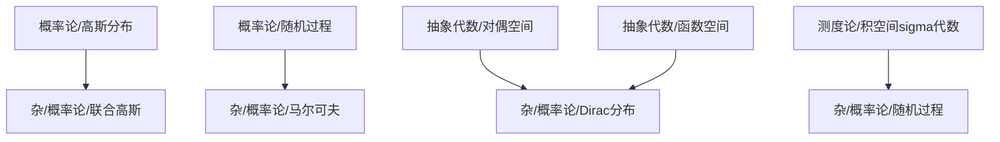

```mermaid
graph TD
2["概率论/高斯分布"] --> 1["杂/概率论/联合高斯"]
5["概率论/随机过程"] --> 4["杂/概率论/马尔可夫"]
7["抽象代数/对偶空间"] --> 6["杂/概率论/Dirac分布"]
8["抽象代数/函数空间"] --> 6["杂/概率论/Dirac分布"]
10["测度论/积空间sigma代数"] --> 9["杂/概率论/随机过程"]
```