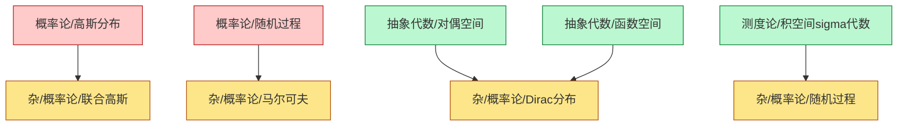

```mermaid
graph TD
1["概率论/高斯分布"] --> 0["杂/概率论/联合高斯"]
3["概率论/随机过程"] --> 2["杂/概率论/马尔可夫"]
5["抽象代数/对偶空间"] --> 4["杂/概率论/Dirac分布"]
6["抽象代数/函数空间"] --> 4["杂/概率论/Dirac分布"]
8["测度论/积空间sigma代数"] --> 7["杂/概率论/随机过程"]
classDef leaf fill:#fde68a,stroke:#b45309
class 0,2,4,7 leaf
classDef externalRoot fill:#fecaca,stroke:#b91c1c
class 1,3 externalRoot
classDef foundationRoot fill:#bbf7d0,stroke:#15803d
class 5,6,8 foundationRoot
```