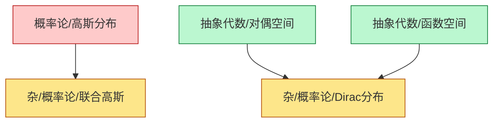

```mermaid
graph TD
1["概率论/高斯分布"] --> 0["杂/概率论/联合高斯"]
3["抽象代数/对偶空间"] --> 2["杂/概率论/Dirac分布"]
4["抽象代数/函数空间"] --> 2["杂/概率论/Dirac分布"]
classDef leaf fill:#fde68a,stroke:#b45309
class 0,2 leaf
classDef externalRoot fill:#fecaca,stroke:#b91c1c
class 1 externalRoot
classDef foundationRoot fill:#bbf7d0,stroke:#15803d
class 3,4 foundationRoot
```