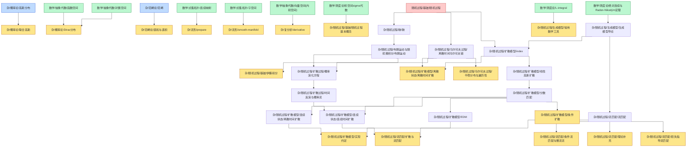

```mermaid
%%{init: {'flowchart': {'curve': 'stepAfter'}}}%%
graph TD
1["杂/概率论/高斯分布"] --> 0["杂/概率论/联合高斯"]
3["数学/抽象代数/对偶空间"] --> 2["杂/概率论/Dirac分布"]
4["数学/抽象代数/函数空间"] --> 2["杂/概率论/Dirac分布"]
6["杂/范畴论/范畴"] --> 5["杂/范畴论/直和与直积"]
8["数学/点集拓扑/连续映射"] --> 7["杂/流形/prepare"]
10["数学/点集拓扑/子空间"] --> 9["杂/流形/smooth-manifold"]
12["数学/抽象代数/向量空间(内积空间)"] --> 11["杂/复分析/derivative"]
14["杂/随机过程/流匹配/流匹配"] --> 13["杂/随机过程/流匹配/损失指导流匹配"]
14["杂/随机过程/流匹配/流匹配"] --> 15["杂/随机过程/流匹配/理论补充"]
14["杂/随机过程/流匹配/流匹配"] --> 16["杂/随机过程/流匹配/条件流匹配与整流流"]
18["杂/随机过程/扩散模型/连续状态/连续时间扩散"] --> 17["杂/随机过程/流匹配/扩散与流匹配"]
14["杂/随机过程/流匹配/流匹配"] --> 17["杂/随机过程/流匹配/扩散与流匹配"]
19["杂/随机过程/生成模型/生成模型导论"] --> 14["杂/随机过程/流匹配/流匹配"]
21["杂/随机过程/扩散模型/连续状态/离散时间扩散"] --> 20["杂/随机过程/扩散模型/实现约定"]
22["杂/随机过程/扩散模型/EDM"] --> 20["杂/随机过程/扩散模型/实现约定"]
24["杂/随机过程/扩散模型/index"] --> 23["杂/随机过程/扩散模型/线性高斯扩散"]
26["杂/随机过程/扩散模型/分数匹配"] --> 25["杂/随机过程/扩散模型/条件扩散"]
23["杂/随机过程/扩散模型/线性高斯扩散"] --> 26["杂/随机过程/扩散模型/分数匹配"]
27["随机过程/基础/随机过程"] --> 24["杂/随机过程/扩散模型/index"]
19["杂/随机过程/生成模型/生成模型导论"] --> 24["杂/随机过程/扩散模型/index"]
26["杂/随机过程/扩散模型/分数匹配"] --> 22["杂/随机过程/扩散模型/EDM"]
27["随机过程/基础/随机过程"] --> 28["杂/随机过程/马尔可夫过程/离散时间马尔可夫链"]
28["杂/随机过程/马尔可夫过程/离散时间马尔可夫链"] --> 29["杂/随机过程/马尔可夫过程/平稳分布与遍历性"]
31["数学/测度论/积空间sigma代数"] --> 30["杂/随机过程/基础/随机过程基本概念"]
33["杂/随机过程/布朗运动与随机微积分/布朗运动"] --> 32["杂/随机过程/基础/伊藤积分"]
34["杂/随机过程/鞅/鞅"] --> 33["杂/随机过程/布朗运动与随机微积分/布朗运动"]
27["随机过程/基础/随机过程"] --> 34["杂/随机过程/鞅/鞅"]
35["数学/测度论/绝对连续与Radon-Nikodým定理"] --> 19["杂/随机过程/生成模型/生成模型导论"]
37["数学/测度论/L-integral"] --> 36["杂/随机过程/生成模型/常用数学工具"]
28["杂/随机过程/马尔可夫过程/离散时间马尔可夫链"] --> 38["杂/随机过程/扩散过程/概率演化方程"]
33["杂/随机过程/布朗运动与随机微积分/布朗运动"] --> 38["杂/随机过程/扩散过程/概率演化方程"]
38["杂/随机过程/扩散过程/概率演化方程"] --> 39["杂/随机过程/扩散过程/时间反演与概率流"]
26["杂/随机过程/扩散模型/分数匹配"] --> 18["杂/随机过程/扩散模型/连续状态/连续时间扩散"]
39["杂/随机过程/扩散过程/时间反演与概率流"] --> 18["杂/随机过程/扩散模型/连续状态/连续时间扩散"]
26["杂/随机过程/扩散模型/分数匹配"] --> 21["杂/随机过程/扩散模型/连续状态/离散时间扩散"]
24["杂/随机过程/扩散模型/index"] --> 40["杂/随机过程/扩散模型/离散状态/离散时间扩散"]
28["杂/随机过程/马尔可夫过程/离散时间马尔可夫链"] --> 40["杂/随机过程/扩散模型/离散状态/离散时间扩散"]
classDef leaf fill:#fde68a,stroke:#b45309
class 0,2,5,7,9,11,13,15,16,17,20,25,29,30,32,36,40 leaf
classDef root fill:#bfdbfe,stroke:#1d4ed8
class 1,6 root
classDef externalRoot fill:#fecaca,stroke:#b91c1c
class 27 externalRoot
classDef foundationRoot fill:#bbf7d0,stroke:#15803d
class 3,4,8,10,12,31,35,37 foundationRoot
click 0 "/杂/概率论/联合高斯" "杂/概率论/联合高斯"
click 1 "/杂/概率论/高斯分布" "杂/概率论/高斯分布"
click 2 "/杂/概率论/dirac分布" "杂/概率论/Dirac分布"
click 3 "/数学/抽象代数/对偶空间" "数学/抽象代数/对偶空间"
click 4 "/数学/抽象代数/函数空间" "数学/抽象代数/函数空间"
click 5 "/杂/范畴论/直和与直积" "杂/范畴论/直和与直积"
click 6 "/杂/范畴论/范畴" "杂/范畴论/范畴"
click 7 "/杂/流形/prepare" "杂/流形/prepare"
click 8 "/数学/点集拓扑/连续映射" "数学/点集拓扑/连续映射"
click 9 "/杂/流形/smooth-manifold" "杂/流形/smooth-manifold"
click 10 "/数学/点集拓扑/子空间" "数学/点集拓扑/子空间"
click 11 "/杂/复分析/derivative" "杂/复分析/derivative"
click 12 "/数学/抽象代数/向量空间(内积空间)" "数学/抽象代数/向量空间(内积空间)"
click 13 "/杂/随机过程/流匹配/损失指导流匹配" "杂/随机过程/流匹配/损失指导流匹配"
click 14 "/杂/随机过程/流匹配/流匹配" "杂/随机过程/流匹配/流匹配"
click 15 "/杂/随机过程/流匹配/理论补充" "杂/随机过程/流匹配/理论补充"
click 16 "/杂/随机过程/流匹配/条件流匹配与整流流" "杂/随机过程/流匹配/条件流匹配与整流流"
click 17 "/杂/随机过程/流匹配/扩散与流匹配" "杂/随机过程/流匹配/扩散与流匹配"
click 18 "/杂/随机过程/扩散模型/连续状态/连续时间扩散" "杂/随机过程/扩散模型/连续状态/连续时间扩散"
click 19 "/杂/随机过程/生成模型/生成模型导论" "杂/随机过程/生成模型/生成模型导论"
click 20 "/杂/随机过程/扩散模型/实现约定" "杂/随机过程/扩散模型/实现约定"
click 21 "/杂/随机过程/扩散模型/连续状态/离散时间扩散" "杂/随机过程/扩散模型/连续状态/离散时间扩散"
click 22 "/杂/随机过程/扩散模型/edm" "杂/随机过程/扩散模型/EDM"
click 23 "/杂/随机过程/扩散模型/线性高斯扩散" "杂/随机过程/扩散模型/线性高斯扩散"
click 24 "/杂/随机过程/扩散模型/index" "杂/随机过程/扩散模型/index"
click 25 "/杂/随机过程/扩散模型/条件扩散" "杂/随机过程/扩散模型/条件扩散"
click 26 "/杂/随机过程/扩散模型/分数匹配" "杂/随机过程/扩散模型/分数匹配"
click 27 "/随机过程/基础/随机过程" "随机过程/基础/随机过程"
click 28 "/杂/随机过程/马尔可夫过程/离散时间马尔可夫链" "杂/随机过程/马尔可夫过程/离散时间马尔可夫链"
click 29 "/杂/随机过程/马尔可夫过程/平稳分布与遍历性" "杂/随机过程/马尔可夫过程/平稳分布与遍历性"
click 30 "/杂/随机过程/基础/随机过程基本概念" "杂/随机过程/基础/随机过程基本概念"
click 31 "/数学/测度论/积空间sigma代数" "数学/测度论/积空间sigma代数"
click 32 "/杂/随机过程/基础/伊藤积分" "杂/随机过程/基础/伊藤积分"
click 33 "/杂/随机过程/布朗运动与随机微积分/布朗运动" "杂/随机过程/布朗运动与随机微积分/布朗运动"
click 34 "/杂/随机过程/鞅/鞅" "杂/随机过程/鞅/鞅"
click 35 "/数学/测度论/绝对连续与radon-nikodým定理" "数学/测度论/绝对连续与Radon-Nikodým定理"
click 36 "/杂/随机过程/生成模型/常用数学工具" "杂/随机过程/生成模型/常用数学工具"
click 37 "/数学/测度论/l-integral" "数学/测度论/L-integral"
click 38 "/杂/随机过程/扩散过程/概率演化方程" "杂/随机过程/扩散过程/概率演化方程"
click 39 "/杂/随机过程/扩散过程/时间反演与概率流" "杂/随机过程/扩散过程/时间反演与概率流"
click 40 "/杂/随机过程/扩散模型/离散状态/离散时间扩散" "杂/随机过程/扩散模型/离散状态/离散时间扩散"
```