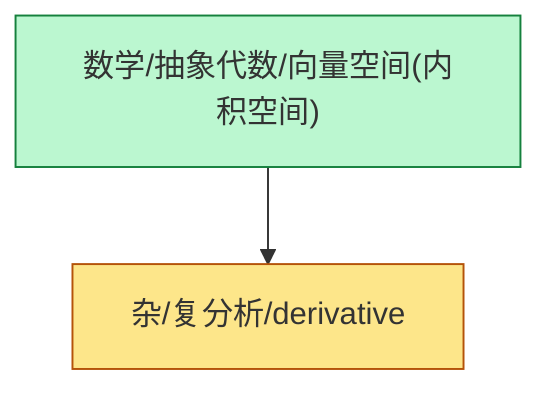

```mermaid
graph TD
1["数学/抽象代数/向量空间(内积空间)"] --> 0["杂/复分析/derivative"]
classDef leaf fill:#fde68a,stroke:#b45309
class 0 leaf
classDef foundationRoot fill:#bbf7d0,stroke:#15803d
class 1 foundationRoot
click 0 "/杂/复分析/derivative" "杂/复分析/derivative"
click 1 "/数学/抽象代数/向量空间(内积空间)" "数学/抽象代数/向量空间(内积空间)"
```