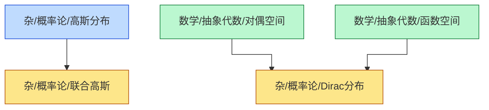

```mermaid
%%{init: {'flowchart': {'curve': 'stepAfter'}}}%%
graph TD
1["杂/概率论/高斯分布"] --> 0["杂/概率论/联合高斯"]
3["数学/抽象代数/对偶空间"] --> 2["杂/概率论/Dirac分布"]
4["数学/抽象代数/函数空间"] --> 2["杂/概率论/Dirac分布"]
classDef leaf fill:#fde68a,stroke:#b45309
class 0,2 leaf
classDef root fill:#bfdbfe,stroke:#1d4ed8
class 1 root
classDef foundationRoot fill:#bbf7d0,stroke:#15803d
class 3,4 foundationRoot
click 0 "/杂/概率论/联合高斯" "杂/概率论/联合高斯"
click 1 "/杂/概率论/高斯分布" "杂/概率论/高斯分布"
click 2 "/杂/概率论/dirac分布" "杂/概率论/Dirac分布"
click 3 "/数学/抽象代数/对偶空间" "数学/抽象代数/对偶空间"
click 4 "/数学/抽象代数/函数空间" "数学/抽象代数/函数空间"
```