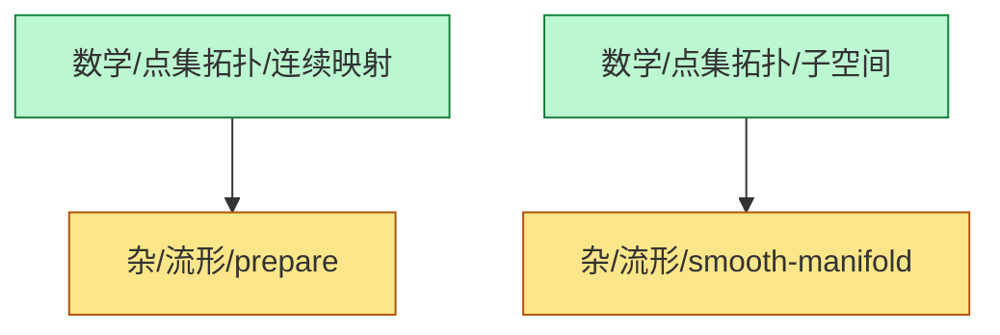

```mermaid
%%{init: {'flowchart': {'curve': 'stepAfter'}}}%%
graph TD
1["数学/点集拓扑/连续映射"] --> 0["杂/流形/prepare"]
3["数学/点集拓扑/子空间"] --> 2["杂/流形/smooth-manifold"]
classDef leaf fill:#fde68a,stroke:#b45309
class 0,2 leaf
classDef foundationRoot fill:#bbf7d0,stroke:#15803d
class 1,3 foundationRoot
click 0 "/杂/流形/prepare" "杂/流形/prepare"
click 1 "/数学/点集拓扑/连续映射" "数学/点集拓扑/连续映射"
click 2 "/杂/流形/smooth-manifold" "杂/流形/smooth-manifold"
click 3 "/数学/点集拓扑/子空间" "数学/点集拓扑/子空间"
```