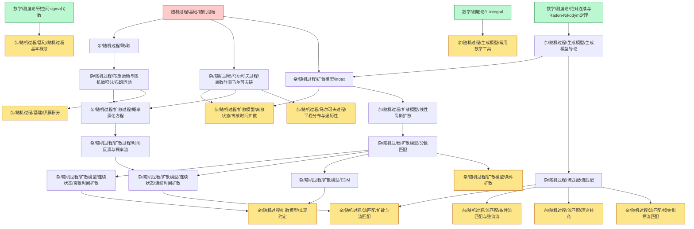

```mermaid
graph TD
1["杂/随机过程/流匹配/流匹配"] --> 0["杂/随机过程/流匹配/损失指导流匹配"]
1["杂/随机过程/流匹配/流匹配"] --> 2["杂/随机过程/流匹配/理论补充"]
1["杂/随机过程/流匹配/流匹配"] --> 3["杂/随机过程/流匹配/条件流匹配与整流流"]
5["杂/随机过程/扩散模型/连续状态/连续时间扩散"] --> 4["杂/随机过程/流匹配/扩散与流匹配"]
1["杂/随机过程/流匹配/流匹配"] --> 4["杂/随机过程/流匹配/扩散与流匹配"]
6["杂/随机过程/生成模型/生成模型导论"] --> 1["杂/随机过程/流匹配/流匹配"]
8["杂/随机过程/扩散模型/连续状态/离散时间扩散"] --> 7["杂/随机过程/扩散模型/实现约定"]
9["杂/随机过程/扩散模型/EDM"] --> 7["杂/随机过程/扩散模型/实现约定"]
11["杂/随机过程/扩散模型/index"] --> 10["杂/随机过程/扩散模型/线性高斯扩散"]
13["杂/随机过程/扩散模型/分数匹配"] --> 12["杂/随机过程/扩散模型/条件扩散"]
10["杂/随机过程/扩散模型/线性高斯扩散"] --> 13["杂/随机过程/扩散模型/分数匹配"]
14["随机过程/基础/随机过程"] --> 11["杂/随机过程/扩散模型/index"]
6["杂/随机过程/生成模型/生成模型导论"] --> 11["杂/随机过程/扩散模型/index"]
13["杂/随机过程/扩散模型/分数匹配"] --> 9["杂/随机过程/扩散模型/EDM"]
14["随机过程/基础/随机过程"] --> 15["杂/随机过程/马尔可夫过程/离散时间马尔可夫链"]
15["杂/随机过程/马尔可夫过程/离散时间马尔可夫链"] --> 16["杂/随机过程/马尔可夫过程/平稳分布与遍历性"]
18["数学/测度论/积空间sigma代数"] --> 17["杂/随机过程/基础/随机过程基本概念"]
20["杂/随机过程/布朗运动与随机微积分/布朗运动"] --> 19["杂/随机过程/基础/伊藤积分"]
21["杂/随机过程/鞅/鞅"] --> 20["杂/随机过程/布朗运动与随机微积分/布朗运动"]
14["随机过程/基础/随机过程"] --> 21["杂/随机过程/鞅/鞅"]
22["数学/测度论/绝对连续与Radon-Nikodým定理"] --> 6["杂/随机过程/生成模型/生成模型导论"]
24["数学/测度论/L-integral"] --> 23["杂/随机过程/生成模型/常用数学工具"]
15["杂/随机过程/马尔可夫过程/离散时间马尔可夫链"] --> 25["杂/随机过程/扩散过程/概率演化方程"]
20["杂/随机过程/布朗运动与随机微积分/布朗运动"] --> 25["杂/随机过程/扩散过程/概率演化方程"]
25["杂/随机过程/扩散过程/概率演化方程"] --> 26["杂/随机过程/扩散过程/时间反演与概率流"]
13["杂/随机过程/扩散模型/分数匹配"] --> 5["杂/随机过程/扩散模型/连续状态/连续时间扩散"]
26["杂/随机过程/扩散过程/时间反演与概率流"] --> 5["杂/随机过程/扩散模型/连续状态/连续时间扩散"]
13["杂/随机过程/扩散模型/分数匹配"] --> 8["杂/随机过程/扩散模型/连续状态/离散时间扩散"]
11["杂/随机过程/扩散模型/index"] --> 27["杂/随机过程/扩散模型/离散状态/离散时间扩散"]
15["杂/随机过程/马尔可夫过程/离散时间马尔可夫链"] --> 27["杂/随机过程/扩散模型/离散状态/离散时间扩散"]
classDef leaf fill:#fde68a,stroke:#b45309
class 0,2,3,4,7,12,16,17,19,23,27 leaf
classDef externalRoot fill:#fecaca,stroke:#b91c1c
class 14 externalRoot
classDef foundationRoot fill:#bbf7d0,stroke:#15803d
class 18,22,24 foundationRoot
click 0 "/杂/随机过程/流匹配/损失指导流匹配" "杂/随机过程/流匹配/损失指导流匹配"
click 1 "/杂/随机过程/流匹配/流匹配" "杂/随机过程/流匹配/流匹配"
click 2 "/杂/随机过程/流匹配/理论补充" "杂/随机过程/流匹配/理论补充"
click 3 "/杂/随机过程/流匹配/条件流匹配与整流流" "杂/随机过程/流匹配/条件流匹配与整流流"
click 4 "/杂/随机过程/流匹配/扩散与流匹配" "杂/随机过程/流匹配/扩散与流匹配"
click 5 "/杂/随机过程/扩散模型/连续状态/连续时间扩散" "杂/随机过程/扩散模型/连续状态/连续时间扩散"
click 6 "/杂/随机过程/生成模型/生成模型导论" "杂/随机过程/生成模型/生成模型导论"
click 7 "/杂/随机过程/扩散模型/实现约定" "杂/随机过程/扩散模型/实现约定"
click 8 "/杂/随机过程/扩散模型/连续状态/离散时间扩散" "杂/随机过程/扩散模型/连续状态/离散时间扩散"
click 9 "/杂/随机过程/扩散模型/edm" "杂/随机过程/扩散模型/EDM"
click 10 "/杂/随机过程/扩散模型/线性高斯扩散" "杂/随机过程/扩散模型/线性高斯扩散"
click 11 "/杂/随机过程/扩散模型/index" "杂/随机过程/扩散模型/index"
click 12 "/杂/随机过程/扩散模型/条件扩散" "杂/随机过程/扩散模型/条件扩散"
click 13 "/杂/随机过程/扩散模型/分数匹配" "杂/随机过程/扩散模型/分数匹配"
click 14 "/随机过程/基础/随机过程" "随机过程/基础/随机过程"
click 15 "/杂/随机过程/马尔可夫过程/离散时间马尔可夫链" "杂/随机过程/马尔可夫过程/离散时间马尔可夫链"
click 16 "/杂/随机过程/马尔可夫过程/平稳分布与遍历性" "杂/随机过程/马尔可夫过程/平稳分布与遍历性"
click 17 "/杂/随机过程/基础/随机过程基本概念" "杂/随机过程/基础/随机过程基本概念"
click 18 "/数学/测度论/积空间sigma代数" "数学/测度论/积空间sigma代数"
click 19 "/杂/随机过程/基础/伊藤积分" "杂/随机过程/基础/伊藤积分"
click 20 "/杂/随机过程/布朗运动与随机微积分/布朗运动" "杂/随机过程/布朗运动与随机微积分/布朗运动"
click 21 "/杂/随机过程/鞅/鞅" "杂/随机过程/鞅/鞅"
click 22 "/数学/测度论/绝对连续与radon-nikodým定理" "数学/测度论/绝对连续与Radon-Nikodým定理"
click 23 "/杂/随机过程/生成模型/常用数学工具" "杂/随机过程/生成模型/常用数学工具"
click 24 "/数学/测度论/l-integral" "数学/测度论/L-integral"
click 25 "/杂/随机过程/扩散过程/概率演化方程" "杂/随机过程/扩散过程/概率演化方程"
click 26 "/杂/随机过程/扩散过程/时间反演与概率流" "杂/随机过程/扩散过程/时间反演与概率流"
click 27 "/杂/随机过程/扩散模型/离散状态/离散时间扩散" "杂/随机过程/扩散模型/离散状态/离散时间扩散"
```