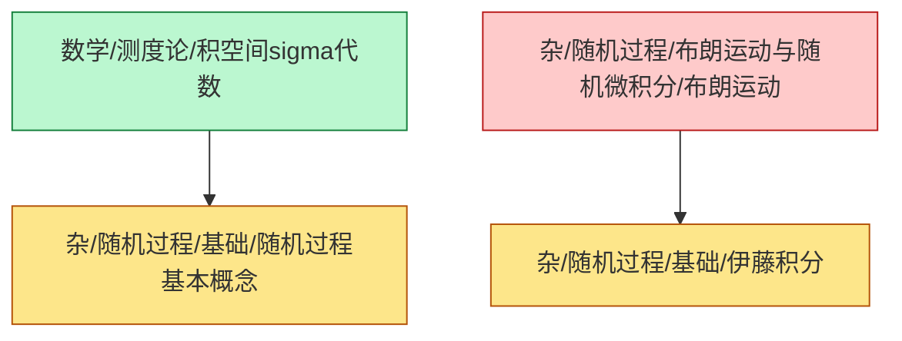

```mermaid
%%{init: {'flowchart': {'curve': 'stepAfter'}}}%%
graph TD
1["数学/测度论/积空间sigma代数"] --> 0["杂/随机过程/基础/随机过程基本概念"]
3["杂/随机过程/布朗运动与随机微积分/布朗运动"] --> 2["杂/随机过程/基础/伊藤积分"]
classDef leaf fill:#fde68a,stroke:#b45309
class 0,2 leaf
classDef externalRoot fill:#fecaca,stroke:#b91c1c
class 3 externalRoot
classDef foundationRoot fill:#bbf7d0,stroke:#15803d
class 1 foundationRoot
click 0 "/杂/随机过程/基础/随机过程基本概念" "杂/随机过程/基础/随机过程基本概念"
click 1 "/数学/测度论/积空间sigma代数" "数学/测度论/积空间sigma代数"
click 2 "/杂/随机过程/基础/伊藤积分" "杂/随机过程/基础/伊藤积分"
click 3 "/杂/随机过程/布朗运动与随机微积分/布朗运动" "杂/随机过程/布朗运动与随机微积分/布朗运动"
```