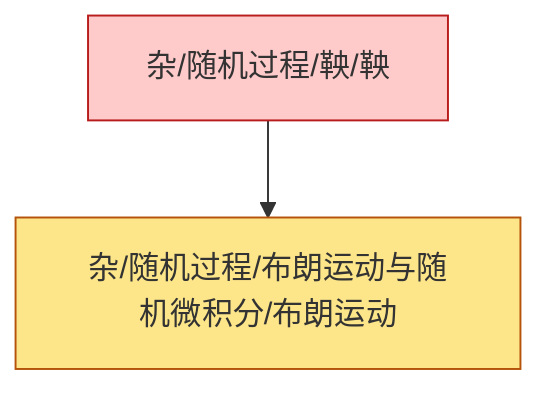

```mermaid
%%{init: {'flowchart': {'curve': 'stepAfter'}}}%%
graph TD
1["杂/随机过程/鞅/鞅"] --> 0["杂/随机过程/布朗运动与随机微积分/布朗运动"]
classDef leaf fill:#fde68a,stroke:#b45309
class 0 leaf
classDef externalRoot fill:#fecaca,stroke:#b91c1c
class 1 externalRoot
click 0 "/杂/随机过程/布朗运动与随机微积分/布朗运动" "杂/随机过程/布朗运动与随机微积分/布朗运动"
click 1 "/杂/随机过程/鞅/鞅" "杂/随机过程/鞅/鞅"
```