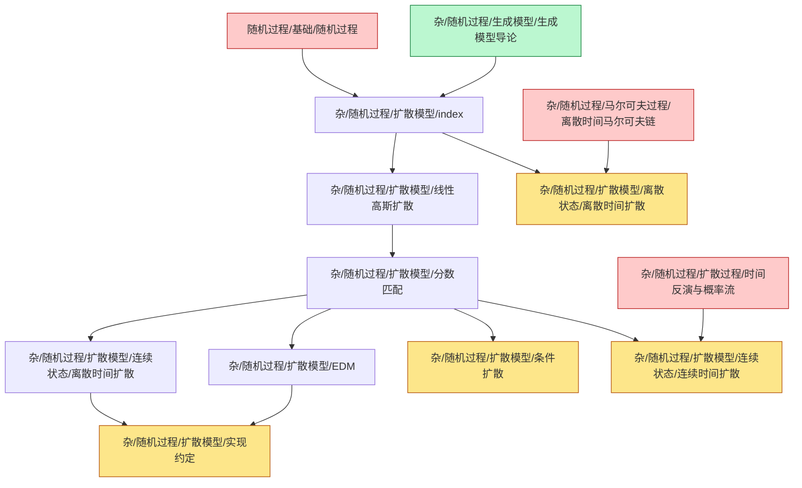

```mermaid
graph TD
1["杂/随机过程/扩散模型/连续状态/离散时间扩散"] --> 0["杂/随机过程/扩散模型/实现约定"]
2["杂/随机过程/扩散模型/EDM"] --> 0["杂/随机过程/扩散模型/实现约定"]
4["杂/随机过程/扩散模型/index"] --> 3["杂/随机过程/扩散模型/线性高斯扩散"]
6["杂/随机过程/扩散模型/分数匹配"] --> 5["杂/随机过程/扩散模型/条件扩散"]
3["杂/随机过程/扩散模型/线性高斯扩散"] --> 6["杂/随机过程/扩散模型/分数匹配"]
7["随机过程/基础/随机过程"] --> 4["杂/随机过程/扩散模型/index"]
8["杂/随机过程/生成模型/生成模型导论"] --> 4["杂/随机过程/扩散模型/index"]
6["杂/随机过程/扩散模型/分数匹配"] --> 2["杂/随机过程/扩散模型/EDM"]
6["杂/随机过程/扩散模型/分数匹配"] --> 9["杂/随机过程/扩散模型/连续状态/连续时间扩散"]
10["杂/随机过程/扩散过程/时间反演与概率流"] --> 9["杂/随机过程/扩散模型/连续状态/连续时间扩散"]
6["杂/随机过程/扩散模型/分数匹配"] --> 1["杂/随机过程/扩散模型/连续状态/离散时间扩散"]
4["杂/随机过程/扩散模型/index"] --> 11["杂/随机过程/扩散模型/离散状态/离散时间扩散"]
12["杂/随机过程/马尔可夫过程/离散时间马尔可夫链"] --> 11["杂/随机过程/扩散模型/离散状态/离散时间扩散"]
classDef leaf fill:#fde68a,stroke:#b45309
class 0,5,9,11 leaf
classDef externalRoot fill:#fecaca,stroke:#b91c1c
class 7,10,12 externalRoot
classDef foundationRoot fill:#bbf7d0,stroke:#15803d
class 8 foundationRoot
click 0 "/杂/随机过程/扩散模型/实现约定" "杂/随机过程/扩散模型/实现约定"
click 1 "/杂/随机过程/扩散模型/连续状态/离散时间扩散" "杂/随机过程/扩散模型/连续状态/离散时间扩散"
click 2 "/杂/随机过程/扩散模型/edm" "杂/随机过程/扩散模型/EDM"
click 3 "/杂/随机过程/扩散模型/线性高斯扩散" "杂/随机过程/扩散模型/线性高斯扩散"
click 4 "/杂/随机过程/扩散模型/index" "杂/随机过程/扩散模型/index"
click 5 "/杂/随机过程/扩散模型/条件扩散" "杂/随机过程/扩散模型/条件扩散"
click 6 "/杂/随机过程/扩散模型/分数匹配" "杂/随机过程/扩散模型/分数匹配"
click 7 "/随机过程/基础/随机过程" "随机过程/基础/随机过程"
click 8 "/杂/随机过程/生成模型/生成模型导论" "杂/随机过程/生成模型/生成模型导论"
click 9 "/杂/随机过程/扩散模型/连续状态/连续时间扩散" "杂/随机过程/扩散模型/连续状态/连续时间扩散"
click 10 "/杂/随机过程/扩散过程/时间反演与概率流" "杂/随机过程/扩散过程/时间反演与概率流"
click 11 "/杂/随机过程/扩散模型/离散状态/离散时间扩散" "杂/随机过程/扩散模型/离散状态/离散时间扩散"
click 12 "/杂/随机过程/马尔可夫过程/离散时间马尔可夫链" "杂/随机过程/马尔可夫过程/离散时间马尔可夫链"
```