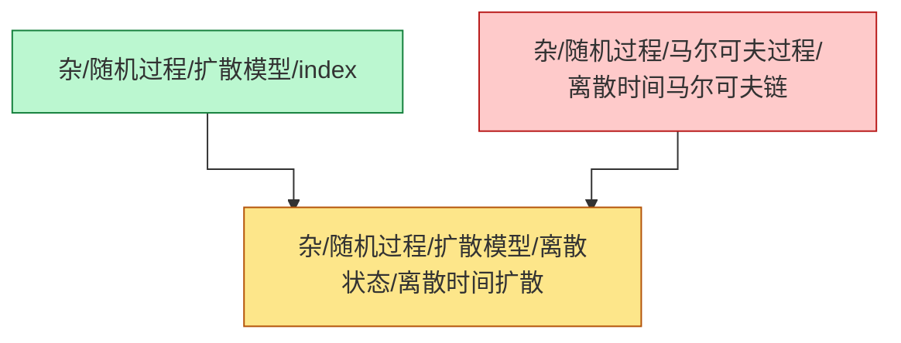

```mermaid
%%{init: {'flowchart': {'curve': 'stepAfter'}}}%%
graph TD
1["杂/随机过程/扩散模型/index"] --> 0["杂/随机过程/扩散模型/离散状态/离散时间扩散"]
2["杂/随机过程/马尔可夫过程/离散时间马尔可夫链"] --> 0["杂/随机过程/扩散模型/离散状态/离散时间扩散"]
classDef leaf fill:#fde68a,stroke:#b45309
class 0 leaf
classDef externalRoot fill:#fecaca,stroke:#b91c1c
class 2 externalRoot
classDef foundationRoot fill:#bbf7d0,stroke:#15803d
class 1 foundationRoot
click 0 "/杂/随机过程/扩散模型/离散状态/离散时间扩散" "杂/随机过程/扩散模型/离散状态/离散时间扩散"
click 1 "/杂/随机过程/扩散模型/index" "杂/随机过程/扩散模型/index"
click 2 "/杂/随机过程/马尔可夫过程/离散时间马尔可夫链" "杂/随机过程/马尔可夫过程/离散时间马尔可夫链"
```